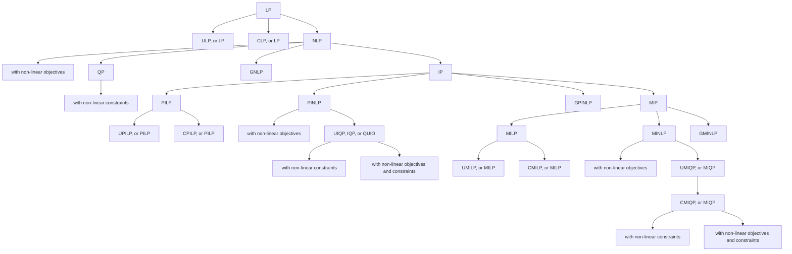

   

## Introduction

**FelooPy** (pronounced /fɛlupaɪ/) is an **integrated optimization environment** (IOE) designed for **decision optimization**. It involves the use of **automated operations research** (AutoOR) methods and techniques to identify **feasible solutions** that lead to **logical decisions** with the **optimal (best possible)** outcomes based on **given** or **learnable** policies. This Python library **simplifies** and **enhances** the use of **_existing_** and **_originally developed_** modeling, algorithm development, and analytical tools for decision-making within simulated **systems**, **industries**, and **supply chains**. FelooPy is an acronym alluding to an operations research scientist in pursuit of **fe**asible solutions, **lo**gical decisions, and **op**timal outcomes by optimization in **Py**thon. Additionally, it alludes to the concept of **loops** in computer programming and the **floppy disk**, symbolizing computing and memory efficiency. The development of FelooPy, which started in **September 2022**, continues under the **MIT license**.

Overview:

 

Learn more:

 

## Features

FelooPy supports the following _mathematical structure-based_ classification of optimization problems:

 - Linear Programming (LP)
   - [Unconstrained] Linear Programming (ULP, or LP)
   - [Constrained] Linear Programming (CLP, or LP)
 - Non-Linear Programming (NLP)
   - with non-linear objectives
      - [Unconstrained] Quadratic Programming (UQP, or QP)
      - [Constrained] Quadratic Programming (CQP, or QP)
   - with non-linear constraints
      - Second Order Cone Programming (SOCP)
   - with non-linear objectives and constraints
      - General Non-Linear Programming (GNLP)
- Integer Programming (IP)
   - Pure Integer Linear Programming (PILP)
      - [Unconstrained] Pure Integer Linear Programming (UPILP, or PILP)
      - [Constrained] Pure Integer Linear Programming (CPILP, or PILP)
   - Pure Integer Non-Linear Programming (PINLP)
      - with non-linear objectives
         - [Unconstrained] Integer Quadratic Programming (UIQP, IQP, or QUIO)
         - [Unconstrained] Binary Quadratic Programming (UBQP, BQP, or QUBO)
         - [Constrained] Integer Quadratic Programming (CIQP, CIQP, or QUIO)
         - [Constrained] Binary Quadratic Programming (CBQP, CBQP, or QUBO)
      - with non-linear constraints
      - with non-linear objectives and constraints
         - General Pure Integer Non-Linear Programming (GPINLP)
 - Mixed Integer Programming (MIP)
   - Mixed Integer Linear Programming (MILP)
      - [Unconstrained] Mixed Integer Linear Programming (UMILP, or MILP)
      - [Constrained] Mixed Integer Linear Programming (CMILP, or MILP)
   - Mixed Integer Non-Linear Programming (MINLP)
      - with non-linear objectives
         - [Unconstrained] Mixed Integer Quadratic Programming (UMIQP, or MIQP)
         - [Constrained] Mixed Integer Quadratic Programming (CMIQP, or MIQP)
      - with non-linear constraints
      - with non-linear objectives and constraints
         - General Mixed Integer Non-Linear Programming (GMINLP)

