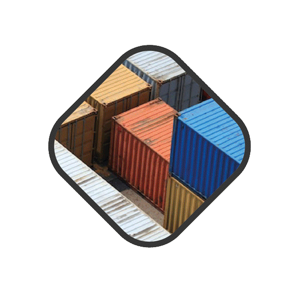

[](https://github.com/ktafakkori/feloopy/releases)
[](https://www.python.org/downloads/release/python-390/)


[](https://pepy.tech/project/feloopy)

[](http://isitmaintained.com/project/ktafakkori/feloopy "Average time to resolve an issue")
[](http://isitmaintained.com/project/ktafakkori/feloopy "Percentage of issues still open")

[](https://opensource.org/licenses/MIT)

<p align="center">
  
</p>

# FelooPy: An integrated optimization environment for AutoOR in Python

FelooPy (/fɛlupaɪ/, an abbreviation for feasible, logical, optimal, and Python) is a hyper-optimization interface and an integrated optimization environment (IOE) that provides an all-in-one exact and heuristic optimization tool for AutoOR in Python. The motivation behind the development of FelooPy is to move the focus of operations research scientists from coding to modeling, and from modeling to analysis/analytics to automate time-consuming, iterative tasks of optimization model development, debugging, and implementation. FelooPy can currently give you access to more than 172 single-objective heuristic optimization solvers (thanks to `mealpy` interface) and 81 single-objective commercial and open-source exact optimization solvers  (thanks to `pyomo`,`pulp`,`ortools`, `gekko`, `cplex`, `gurobi`, `xpress`, `picos`, `pymprog`, `cvxpy`, `cylp`, `linopy`, and `mip` interfaces), all with the same coding syntax! Besides, FelooPy automates common tasks in the optimization process and analytics, by providing tools such as sensitivity analysis, automated encoding/decoding (representation method) for heuristic optimization, timers, and more, all in the Python programming language environment.


## Features:

- **Free** and **Open-Source** (FOSS) IOE developed under **MIT** license.
- **Easy** OR model development **workflow**.
- **All-in-One** optimization toolbox.
- Uses **single** optimization programming syntax for **14** **exact** and **heuristic** optimization interfaces in Python.
- Solves an optimization model with **81** exact and **172+5** heuristic optimization solvers (total: **256** optimization algorithms).
- Supports **scalable** optimization for **large-scale** real-world problems.
- Supports **benchmarking** of an optimization problem with various solvers.
- Supports **multi-parameter** sensitivity analysis on a single objective.
- Supports **multi-criteria** and **multi-objective** optimization (coming soon).
- ...

# Installation

*Note*: Installation process requires `python>=3.9`, `pip>=22.3.1` and a stable internet connection.

### Terminal command (e.g., CMD or GC):

```
pip install feloopy==0.2.0
```

### IDE command (e.g., Spyder):

*Note*: After installation, this line of code should be deleted.
```
!pip install feloopy==0.2.0
```

### Inside your Python code

*Note*: After installation, this piece of code should be deleted.

```
import pip

def install(package):
    if hasattr(pip, 'main'):
        pip.main(['install','-U', package])
    else:
        pip._internal.main(['install','-U', package])

install('feloopy')
```

### From GitHub [Releases][a] section

1. Download the feloopy-0.2.0.zip file.
2. Extract it into a specific directory.
3. Open a terminal in that directory.
4. Type: `pip install .`

[a]: https://github.com/ktafakkori/feloopy/releases

### From GitHub repository (Prerelease version)

```
pip install -U git+https://github.com/ktafakkori/feloopy
```

## Documentation

* [Tutorial][01]
* [Examples][02]
* [Exact Solvers][03]
* [Heuristic Solvers][04]
* [Changelog][05]
* [Citation][06]

[01]: https://github.com/ktafakkori/feloopy/Documentation.md
[02]: https://www.linkedin.com/in/keivan-tafakkori/Exact.md
[03]: https://github.com/ktafakkori/feloopy/Heuristic.md
[04]: https://github.com/ktafakkori/feloopy/Changelog.md
[05]: https://github.com/ktafakkori/feloopy/Changelog.md
[06]: https://github.com/ktafakkori/feloopy/Changelog.md

## Contributors


## Supporters

This repository will be more and more complete over time. It is kindly requested to support this work by giving a ⭐ to the repository to make it available for a broad range of audiences who are interested in using exact and heuristic optimization techniques in the Python programming language.

[](https://github.com/ktafakkori/feloopy/stargazers)

Or you might kindly consider consider donations:

* BTC crypto: `bc1q37audm2jd75j3rmralxhejtd44yz5az4e2nf4e`
* ETH crypto: `0xFceE0143E668c83176b96A20e0c386C54Bc9A6b9`
* DOGE crypto: `DSu19Ks5KEbFcqvj8QKAL6pCaoiCYAzpAU`

## Sponsorship

Contact me on [Linkedin][2] or [Twitter][1].

[1]: https://twitter.com/ktafakkori
[2]: https://www.linkedin.com/in/keivan-tafakkori/