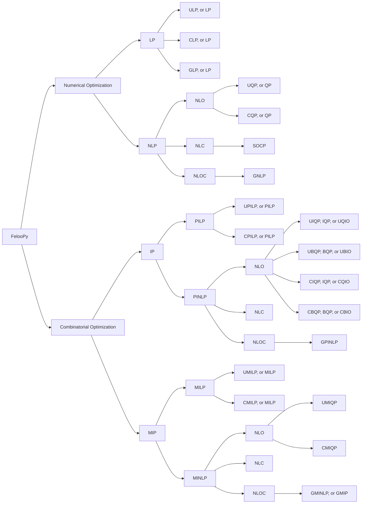
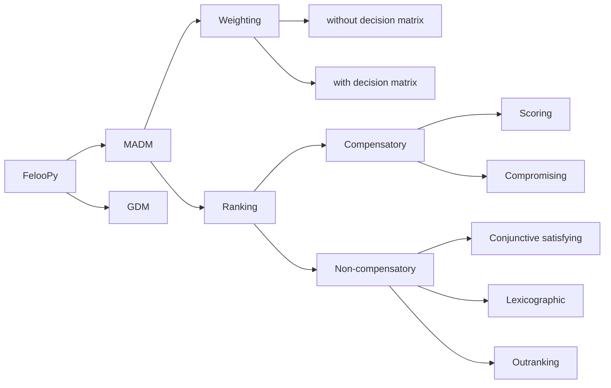

<p align="center">
   
</p>


## Introduction

**FelooPy** (pronounced /fɛlupaɪ/) is an **integrated optimization environment** (IOE) designed as a **decision optimization hub**. It involves the use of **automated operations research** (AutoOR) methods and techniques to identify **feasible solutions** that lead to **logical decisions** with the **optimal (best possible)** outcomes based on **given** or **learnable** policies. This Python library **simplifies** and **enhances** the use of **_existing_** and **_originally developed_** modeling, algorithm development, and analytical tools for decision-making within simulated **systems**, **industries**, and **supply chains**. FelooPy is an acronym alluding to an operations research scientist in pursuit of **fe**asible solutions, **lo**gical decisions, and **op**timal outcomes by optimization in **Py**thon. Additionally, it alludes to the concept of **loops** in computer programming and the **floppy disk**, symbolizing computing and memory efficiency. The development of FelooPy, which started in **September 2022**, continues under the **MIT license**.

Overview:


[](https://pepy.tech/project/feloopy?&left_text=totalusers)
[](https://pypistats.org/packages/feloopy)

[](https://feloopy.readthedocs.io/en/latest/?badge=latest&color=darkgreen)


Learn more:

[](https://www.linkedin.com/groups/12881077/) [](https://t.me/feloop_group)
[](https://instagram.com/feloop_page)

## Features

FelooPy supports the following _mathematical structure-based_ classification of optimization problems:

<details>
<summary>Display as a list</summary>

- Numerical optimization
   - Linear Programming (LP)
      - [Unconstrained] Linear Programming (ULP, or LP)
      - [Constrained] Linear Programming (CLP, or LP)
      - General Linear Programming (GLP, or LP)
   - Non-Linear Programming (NLP)
      - with non-linear objectives
         - [Unconstrained] Quadratic Programming (UQP, or QP)
         - [Constrained] Quadratic Programming (CQP, or QP)
      - with non-linear constraints
         - Second Order Cone Programming (SOCP)
      - with non-linear objectives and constraints
         - General Non-Linear Programming (GNLP)
- Combinatorial optimization
   - Integer Programming (IP)
      - Pure Integer Linear Programming (PILP)
         - [Unconstrained] Pure Integer Linear Programming (UPILP, or PILP)
         - [Constrained] Pure Integer Linear Programming (CPILP, or PILP)
      - Pure Integer Non-Linear Programming (PINLP)
         - with non-linear objectives
            - [Unconstrained] Integer Quadratic Programming (UIQP, IQP, or QUIO)
            - [Unconstrained] Binary Quadratic Programming (UBQP, BQP, or QUBO)
            - [Constrained] Integer Quadratic Programming (CIQP, IQP, or QUIO)
            - [Constrained] Binary Quadratic Programming (CBQP, BQP, or QUBO)
         - with non-linear constraints
         - with non-linear objectives and constraints
            - General Pure Integer Non-Linear Programming (GPINLP)
   - Mixed Integer Programming (MIP)
      - Mixed Integer Linear Programming (MILP)
         - [Unconstrained] Mixed Integer Linear Programming (UMILP, or MILP)
         - [Constrained] Mixed Integer Linear Programming (CMILP, or MILP)
      - Mixed Integer Non-Linear Programming (MINLP)
         - with non-linear objectives
            - [Unconstrained] Mixed Integer Quadratic Programming (UMIQP, or MIQP)
            - [Constrained] Mixed Integer Quadratic Programming (CMIQP, or MIQP)
         - with non-linear constraints
         - with non-linear objectives and constraints
            - General Mixed Integer Non-Linear Programming (GMINLP, or GMIP)

_Credit: Keivan Tafakkori_

</details>

<details>
<summary>Display as a graph</summary>



_Credit: Keivan Tafakkori_

</details>


FelooPy supports the following _expert-based_ classification of decision-making problems:

<details>
<summary>Display as a list</summary>

- Multi-Attribute Decision-Making (MADM)
   - Weighting methods
      - without a decision-making matrix
      - with a decision-making matrix
   - Ranking methods
      - Compensatory methods
         - Scoring methods
         - Compromising methods
      - Non-compensatory methods 
         - Conjunctive satisfying methods
         - Lexicographic methods
         - Outranking methods
         
- Group Decision-Making (GDM)

_Credit: Keivan Tafakkori_

</details>

<details>
<summary>Display as a graph</summary>


_Credit: Keivan Tafakkori_

</details>

## Installation

For a quick installation with a classic support of interfaces and solvers, you may use the `pip` package manager (please refer to this [link](https://pip.pypa.io/en/stable/installation/) to install, update, or get one) as follows:
   
   ```terminal
   pip install -U feloopy[stock]
   ```

However, as some users might prefer a dedicated version, the following lists the available variants of FelooPy:

<details>
<summary>Core variant</summary>

   This variant installs the base package without any additional features. It installs FelooPy with its common dependencies.

   ```terminal
   pip install -U feloopy
   ```
</details>

<details>
<summary>Free variants</summary>

   - `pico` variant:

      This variant installs the base package without any additional features. It is the same as the core variant. It installs FelooPy with its common dependencies.

      ```terminal
      pip install -U feloopy[pico]
      ```

   - `nano` variant:

      This variant includes a small set of additional features. It installs FelooPy with its common dependencies and the `pymprog` package. 

      ```terminal
      pip install -U feloopy[nano]
      ```

   - `micro` variant:

      This variant includes a moderate set of additional features. It installs FelooPy with its common dependencies and the `pymprog`, `gekko`, and `mealpy` packages.

      ```terminal
      pip install -U feloopy[micro]
      ```

   - `mini` variant:

      This variant includes a large set of additional features. It installs FelooPy with its common dependencies and the `pymprog`, `gekko`, `mealpy`, `ortools`, and `cvxpy` packages.

      ```terminal
      pip install -U feloopy[mini]
      ```   

   - `full` variant:

      This variant includes all available features. It installs FelooPy with its common dependencies and the `pymprog`, `gekko`, `mealpy`, `ortools`, `cvxpy`, `pymoo`, and `pydecision` packages.
      
      ```terminal
      pip install -U feloopy[full]
      ```

   - `stock` variant:

      This variant includes all interface packages. It installs FelooPy with its common dependencies and the `gekko`, `ortools`, `pulp`, `pyomo`, `pymprog`, `picos`, `linopy`, `cvxpy`, `mip`, `mealpy`, `pydecision`, `rsome`, `pymoo`, `niapy`, and `pygad` packages.

      ```terminal
      pip install -U feloopy[stock]
      ```

   - `hyper` variant:

      This variant includes all interface and solver packages. It installs FelooPy with its common dependencies and the `gekko`, `ortools`, `pulp`, `pyomo`, `pymprog`, `picos`, `linopy`, `cvxpy`, `mip`, `mealpy`, `pydecision`, `rsome`, `pymoo`, `niapy`, `pygad`, `cplex`, `docplex`, `xpress`, `gurobipy`, `cylp`, and `coptpy` packages.

      ```terminal
      pip install -U feloopy[hyper]
      ```

   <details>
   <summary>Optional installations</summary>

      In what follows, installation scripts for open-source optimization solvers to be used with FelooPy is provided (currently for Linux-based distros):

      ```bash

      VERSION=5.0

      rm -rf glpk-${VERSION}
      rm -rf glpk-${VERSION}.tar.gz

      wget https://ftp.gnu.org/gnu/glpk/glpk-${VERSION}.tar.gz
      tar -xzvf glpk-${VERSION}.tar.gz
      cd glpk-${VERSION}
      export DIR=$HOME/solvers/glpk-${VERSION}
      ./configure --prefix=$DIR
      make
      sudo make install
      cd ..

      rm -rf glpk-${VERSION}
      rm -rf glpk-${VERSION}.tar.gz

      echo "" >>~/.profile
      echo "export PATH=\$PATH:$DIR/bin" >> ~/.profile
      echo "export LD_LIBRARY_PATH=\$LD_LIBRARY_PATH:$DIR/lib" >> ~/.profile
      source ~/.profile

      glpsol --version
      ```

      where `variant_name` is one of the above variants. (please refer to this [link](https://git-scm.com/downloads) to install, update, or get `git`.)

   </details>


</details>

<details>
<summary>Commercial variants</summary>

   `plus_gurobi` variant:

   This variant includes the Gurobi solver. It requires a valid Gurobi license. Refer to the [Gurobi website](https://www.gurobi.com/) for more information.

   ```terminal
   pip install -U feloopy[plus_gurobi]
   ```

   `plus_cplex` variant:

   This variant includes the CPLEX solver. It requires a valid CPLEX license. Refer to the [CPLEX website](https://www.ibm.com/analytics/cplex-optimizer) for more information.

   ```terminal
   pip install -U feloopy[plus_cplex]
   ```

   `plus_xpress` variant:

   This variant includes the Xpress solver. It requires a valid Xpress license. Refer to the [Xpress website](https://www.fico.com/en/products/fico-xpress-optimization) for more information.

   ```terminal
   pip install -U feloopy[plus_xpress]
   ```

   `plus_copt` variant:

   This variant includes the COPT solver. It requires a valid COPT license. Refer to the [COPT website](https://shanshu.ai/copt) for more information.

   ```terminal
   pip install -U feloopy[plus_copt]
   ```

</details>


<details>
<summary>Non-compatible variants</summary>

   `only_cylp` variant:

   This variant includes the CyLP solver. It requires a valid CyLP installation. Refer to this [link](https://github.com/coin-or/CyLP) for more information.

   ```terminal
   pip install -U feloopy[plus_cylp]
   ```

   `only_linux` variant:

   This variant includes additional features for Linux-based distros. It installs FelooPy with its common dependencies and the `pymultiobjective` package.

   ```terminal
   pip install -U feloopy[only_linux]
   ```
</details>


<details>
<summary>Dev variants</summary>

   To contribute to the project, support the developer with pull requests, and to get the latest updates, you can install a development variant as follows:

   ```terminal
   pip install -U git+https://github.com/ktafakkori/feloopy.git#egg=feloopy[variant_name]
   ```

   where `variant_name` is one of the above variants. (please refer to this [link](https://git-scm.com/downloads) to install, update, or get `git`.)

</details>


## Citation
To cite or give credit to FelooPy in publications, projects, presentations, web pages, blog posts, etc. please use the following entries:

- LaTeX:

   ```bibtex
   @software{ktafakkori2022Sep,
   author       = {Keivan Tafakkori},
   title        = {{FelooPy: An integrated optimization environment for AutoOR in Python}},
   year         = {2022},
   month        = sep,
   publisher    = {GitHub},
   url          = {https://github.com/ktafakkori/feloopy/}
   }
   ```

- APA:

   <div style="white-space: pre-wrap;">
   Tafakkori, K. (2022). FelooPy: An integrated optimization environment for AutoOR in Python [Python Library]. Retrieved from https://github.com/ktafakkori/feloopy (Original work published September 2022).
   </div>

- In-text:

   FelooPy (v0.2.7) was used in conjunction with [interface x] (v0.0.0) (except `feloopy` itself) as the optimization interface and [solver y] (v0.0.0) as the optimization solver.

   (Please note that using secondary interfaces or solvers might also require a citation to their projects.)

## License

      Copyright K. Tafakkori, 2022-2023
      See the LICENSE file for copyright information.