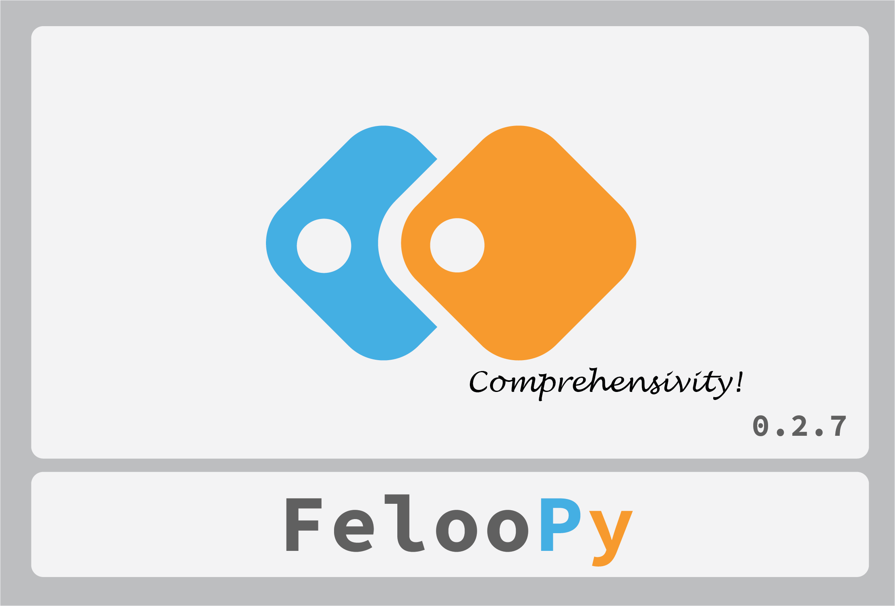
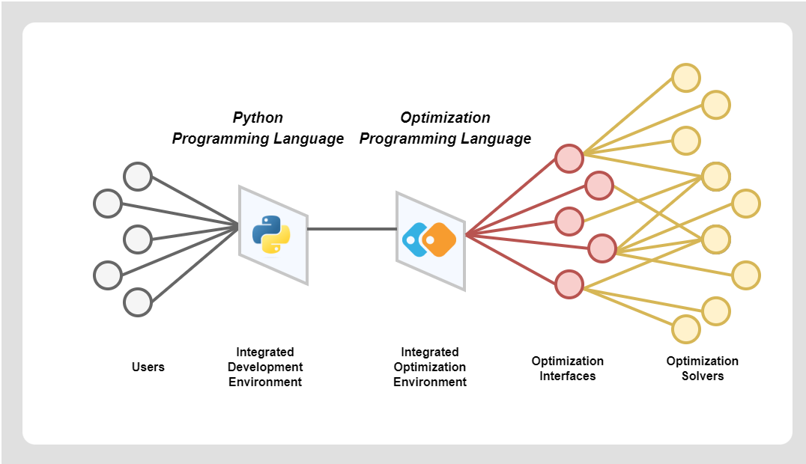

### **Release 🔄**

<div align="center">



</div>

### **Introduction 📦**

| FelooPy | [](https://github.com/ktafakkori/feloopy/releases) [](https://github.com/ktafakkori/feloopy/releases) [](https://pepy.tech/project/feloopy?&left_text=users) [](https://github.com/ktafakkori/feloopy) [](https://opensource.org/licenses/MIT) |
| :--- | :--- |
|  |  **FelooPy** (pronounced /fɛlupaɪ/) is a comprehensive Python library that automates operations research. It serves as a hyper-optimization interface and an integrated optimization environment. FelooPy offers practical solutions for various systems, industries, and supply chains, focusing on finding feasible solutions, logical decisions, and optimal outcomes using Python. The name is a nod to "loops" in programming and algorithm development and "floppy" disk in computing and memory efficiency. FelooPy helps operations research scientists achieve their goals by providing various models and algorithms. In summary, FelooPy is a comprehensive framework for single- and multi-criteria decision-making methods, mathematical modeling, optimization algorithms, and analytics. |
| **News** | 🎉 Version 0.2.7 is out: Comprehensivity! 🎉 |

### **Features ✨**

FelooPy offers the following key features:

* **Simplest optimization programming language**: Designed to be easy to use, even for those with little or no programming experience.
* **Modeling, solving and analyzing optimization problems**: Provides a complete suite of tools for modeling, solving and analyzing a wide range of optimization problems.
* **Exact optimization algorithms**: Supports *108* exact optimization algorithms that guarantee the optimal solution to your problem.
* **Heuristic optimization algorithms**: Supports *197* heuristic optimization algorithms that can find best possible solutions to complex problems.
* **Convex optimization algorithms**: Supports *20* convex optimization algorithms that ease tensor- and matrix-form modeling, primarily for convex problems.
* **Constraint optimization algorithms**: Supports *2* constraint optimization algorithms that can handle a wide range of complex constraints for operational and time-dependent decisions.
* **Multi-objective optimization algorithms**: Supports *17* multi-objective optimization algorithms, in which objectives might be conflicting or with different numerical units.
* **Multi-attribute decision-making methods**: Supports *63* MADM algorithms to solve decision problems with expert-based inputs without mathematical modeling.
* **Solver configurations**: Lets you configure the solver to meet specific requirements.
* **Auto-encoders for general purpose programming**: Provides auto-encoders to simplify general-purpose programming tasks.
* **Auto-linearizers for linear programming conversions**: Provides auto-linearizers that can handle mixed-integer non-linear programming problems.
* **Auto-logic for modeling special constraints**: Provides auto-logic to help you model and solve problems with special constraints.
* **Auto-sensitivity for analyzing the impact of key parameters**: Provides auto-sensitivity tools to help you analyze the impact of key parameters on your optimization problem.



In summary, FelooPy acts as a supply chain hub that seamlessly connects you with optimization interfaces and solvers. With its user-friendly syntax, it's akin to having a personal assistant who simplifies the process of accessing and utilizing existing optimization and analytical tools.

### **Installation 🚀**

FelooPy can be installed on Linux-based distributions, Windows, or macOS. It has a few dependencies that should work on all these platforms.

<div align="center">

<table>
<tr>
<td> Method </td> <td> Description </td> <td> Requirements </td>
</tr>

<tr>
<td> Quick </td>
<td>

```python
pip install --upgrade feloopy
```

</td>
<td> Python >= 3.10 </td>
</tr>

<tr>
<td> PyPI </td>
<td>
    

```python
pip install feloopy==0.2.7
```

</td>
<td> Python >= 3.10 </td>
</tr>

<tr>
<td> Command </td>
<td>
    
```python
!pip install feloopy==0.2.7
```

</td>
<td> Python >= 3.10 </td>
</tr>

<tr>
<td> Script </td>
<td>
    
```python
import pip

def install(package):
  if hasattr(pip, 'main'):
    pip.main(['install','-U', package])
  else:
    pip._internal.main(['install','-U', package])

install('feloopy==0.2.7')
````

</td>
<td> Python >= 3.10 </td>
</tr>

<tr>
<td> Local </td>
<td>

1. Download the [feloopy-0.2.7.zip][c] file.
2. Extract it into a specific directory.
3. Open a terminal in that directory.
4. Type: `pip install .`

</td>

<td> Python >= 3.10 </td>

</tr>

<tr>
<td> Colab </td>
<td>

1. Run this cell and reload (CTRL + R) (using `"py310"` or `"py311"`):

```python
!wget https://github.com/korakot/kora/releases/download/v0.10/py310.sh
!bash ./py310.sh -b -f -p /usr/local
!python -m ipykernel install --name "py310" --user
````

2. Run this cell and reload (CTRL + R):

```python
!pip install feloopy==0.2.7
```

</td>

<td> Python >= 3.10 </td>

</tr>

<tr>
<td> Git </td>
<td>

```python
!pip install -U git+https://github.com/ktafakkori/feloopy
```
</td>

<td> Python >= 3.10 </td>

</tr>

</table>

</div>

FelooPy requires Python 3.10 or later to be installed on your system. If you don't have Python installed or a Python interpreter with the necessary version, you can download it from the [official website](https://www.python.org/downloads/) and follow the installation instructions. Alternatively, if you are using an [Anaconda](https://www.anaconda.com/download/) distribution, you can create a new environment with Python 3.10 or later and install FelooPy in that environment, as follows:

```
conda create --name your_environment python=3.10
conda activate your_environment
pip install feloopy
```

FelooPy (v0.2.7) has a few optional dependencies that can be installed using the following commands (recommended to install if possible):

<div align="center">

| Dependency     | Installation Command                                           | License Help                                                                               | Download Page                                    |
| -------------- | ------------------------------------------------------------- | ------------------------------------------------------------------------------------------ | ------------------------------------------------- |
| All solvers    | `pip install feloopy[all_solvers]`                            | -                                                                                          | -                                                 |
| Gurobi         | `pip install feloopy[gurobi]`                                 | [License](https://support.gurobi.com/hc/en-us/articles/12684663118993-How-do-I-obtain-a-Gurobi-license-#:~:text=You%20will%20need%20a%20license%20in%20order%20to,our%20website%2C%20unless%20it%20is%20a%20client%20license.) | [Download](https://www.gurobi.com/downloads/) |
| Cplex          | `pip install feloopy[cplex]`                                  | [License](https://www.ibm.com/products/ilog-cplex-optimization-studio/pricing) | [Download](https://www.ibm.com/products/ilog-cplex-optimization-studio) |
| Xpress         | `pip install feloopy[xpress]`                                 | [License](https://www.fico.com/en/fico-xpress-trial-and-licensing-options)          | [Download](https://www.fico.com/en/products/fico-xpress-optimization) |
| Copt           | `pip install feloopy[copt]`                                   | [License](https://www.shanshu.ai/copt)                                              | [Download](https://www.shanshu.ai/copt)    |
| Cylp           | `pip install feloopy[cylp]`                                   | [License](https://github.com/coin-or/CyLP) | [Download](https://www.coin-or.org/download/binary/OptimizationSuite/)                                                 |
| Linux          | `pip install feloopy[linux]`                                  | -                                                                                          | -                                                 |
</div>

For multi-objective optimization, you should use the linux command for installation. However, please note that the optional dependencies for the Linux kernel might not work on some operating systems. As a workaround, before using the linux command, you can use an Anaconda-based interpreter to install sub-dependencies for multi-objective optimization. For instance, one of such dependencies is the `pygmo` package, which is easier to be installed by the `conda` package manager as follows (see the [official website](https://esa.github.io/pygmo2/install.html) for more details):

```
conda config --add channels conda-forge
conda config --set channel_priority strict
conda install pygmo
```

### **Documentation 📚**

Please refer to [the documentation website](https://feloopy.readthedocs.io/en/latest/).

### **Contributions 🙌**

We welcome your contributions to this project, such as reporting bugs, submitting pull requests, testing changes, providing examples, and so on.

### **Support FelooPy 🌟**

**Warning: Maintenance Notice** ⚠️

We are committed to continuing the development of FelooPy, but ongoing maintenance and improvements depend on the support of our community. Your assistance is invaluable in keeping FelooPy active and thriving.

Here's how you can contribute:

- **Star the project on GitHub:** Your stars motivate us to keep improving FelooPy. You can give a star to the project [here](https://github.com/ktafakkori/feloopy/stargazers).

- **Fork the project on GitHub:** You can actively contribute to its development by forking it. You can fork the project [here](https://github.com/ktafakkori/feloopy/network/members).

- **Donate:** Your donations help us sustain and maintain the project while adding new features. If you'd like to support us financially, please visit our [support page](https://ktafakkori.github.io/support/).

Your support is vital to FelooPy's future, and we sincerely appreciate your contribution! Thank you for being part of our community.

### **Citation 📖**

If you use the facilities of this GitHub repository or the Python library in your work, we recommend citing it to help others reproduce the results of your research. You may also provide the specific version of the Python library used in your research or project for accuracy and reproducibility. Thank you for your consideration.

- APA 7:

<div style="white-space: pre-wrap;">
Tafakkori, K. (2022). FelooPy: An integrated optimization environment for AutoOR in Python [Python Library]. Retrieved from https://github.com/ktafakkori/feloopy (Original work published September 2022).

</div>

- LaTeX:

<pre>

@software{ktafakkori2022Sep,
  author       = {Keivan Tafakkori},
  title        = {{FelooPy: An integrated optimization environment for AutoOR in Python}},
  year         = {2022},
  month        = sep,
  publisher    = {GitHub},
  url          = {https://github.com/ktafakkori/feloopy/}
}
</pre>


[c]: https://github.com/ktafakkori/feloopy/releases
[support]: https://ktafakkori.github.io/support/

### **License 📜**

FelooPy is completely free and open-source and licensed under the [MIT][08] license.

[08]: https://github.com/ktafakkori/feloopy/blob/main/LICENSE

### **Learn more 🌐**

<div align="center">

| Group/Channel Name | Join Link |
|------------|-----------|
| LinkedIn Group (Language: EN)   | [Join Group](https://www.linkedin.com/groups/12881077/) |
| Instagram Page (Language: EN/FA)   | [Join Page](https://www.instagram.com/feloop_page/) |
| Telegram Group (Language: FA)   | [Join Group](https://t.me/feloop_group) |
| Telegram Channel (Language: FA) | [Join Channel](https://t.me/feloop_channel) |

</div>


### **Supported interfaces and solvers 🔍**


| Exact Interface |    Exact Solver   | Heuristic Interface | Heuristic Solver | Constraint Interface | Constraint Solver | Multi-objective Interface | Multi-objective Solver | Uncertainty Interface | Uncertainty Solver | Weighting Interface | Weighting Solver | Ranking Interface |    Ranking Solver   | Special Interface |    Special Solver    |
|-----------------|-------------------|---------------------|------------------|----------------------|-------------------|---------------------------|------------------------|-----------------------|--------------------|---------------------|------------------|-------------------|---------------------|-------------------|----------------------|
|       copt      |        copt       |       feloopy       |        de        |       cplex-cp       |       cplex       |           pymoo           |      age-mo-ea-ii      |       rsome-dro       |        copt        |      pydecision     |    ahp_method    |     pydecision    |     aras_method     |     pydecision    |    dematel_method    |
|      cplex      |       cplex       |       feloopy       |        ga        |      ortools-cp      |      ortools      |           pymoo           |       age-mo-ea        |       rsome-dro       |       cplex        |      pydecision     | fuzzy_ahp_method |     pydecision    |  fuzzy_aras_method  |     pydecision    | fuzzy_dematel_method |
|      cvxpy      |        cbc        |       feloopy       |       gwo        |          -           |         -         |           pymoo           |         cta-ea         |       rsome-dro       |       cvxpy        |      pydecision     |    bw_method     |     pydecision    |     borda_method    |     pydecision    |      electre_i       |
|      cvxpy      |      clarabel     |       feloopy       |        sa        |          -           |         -         |           pymoo           |       d-ns-ga-ii       |       rsome-dro       |        cylp        |      pydecision     |   cilos_method   |     pydecision    |    cocoso_method    |     pydecision    |     electre_i_s      |
|      cvxpy      |        copt       |       feloopy       |        ts        |          -           |         -         |           pymoo           |        mo-ea-d         |       rsome-dro       |        ecos        |      pydecision     |  critic_method   |     pydecision    |     codas_method    |     pydecision    |     electre_i_v      |
|      cvxpy      |       cplex       |        mealpy       |      a-bfo       |          -           |         -         |           pymoo           |        ns-ga-ii        |       rsome-dro       |       gurobi       |      pydecision     |  entropy_method  |     pydecision    |   copeland_method   |     pydecision    |      electre_ii      |
|      cvxpy      |       cvxopt      |        mealpy       |     adap-ba      |          -           |         -         |           pymoo           |       ns-ga-iii        |       rsome-dro       |       mosek        |      pydecision     |  idocriw_method  |     pydecision    |    copras_method    |     pydecision    |     electre_iii      |
|      cvxpy      |        ecos       |        mealpy       |     adap-eo      |          -           |         -         |           pymoo           |       r-ns-ga-ii       |       rsome-dro       |      ortools       |      pydecision     |   merec_method   |     pydecision    | fuzzy_copras_method |     pydecision    |      electre_iv      |
|      cvxpy      |        glop       |        mealpy       |     augm-aeo     |          -           |         -         |           pymoo           |      r-ns-ga-iii       |       rsome-dro       |       scipy        |       feloopy       |    lp_method     |     pydecision    |    cradis_method    |     pydecision    |    electre_tri_b     |
|      cvxpy      |      glpk-mi      |        mealpy       |     base-alo     |          -           |         -         |           pymoo           |         rv-ea          |        rsome-ro       |        copt        |          -          |        -         |     pydecision    |     edas_method     |     pydecision    |     promethee_i      |
|      cvxpy      |        glpk       |        mealpy       |     base-bbo     |          -           |         -         |           pymoo           |         sms-ea         |        rsome-ro       |       cplex        |          -          |        -         |     pydecision    |  fuzzy_edas_method  |     pydecision    |    promethee_iii     |
|      cvxpy      |       gurobi      |        mealpy       |     base-bro     |          -           |         -         |           pymoo           |        sp-ea-ii        |        rsome-ro       |       cvxpy        |          -          |        -         |     pydecision    |      gra_method     |     pydecision    |     promethee_v      |
|      cvxpy      |       mosek       |        mealpy       |    base-chio     |          -           |         -         |           pymoo           |      u-ns-ga-iii       |        rsome-ro       |        cylp        |          -          |        -         |     pydecision    |     mabac_method    |     pydecision    |    promethee_gaia    |
|      cvxpy      |        nag        |        mealpy       |     base-de      |          -           |         -         |      pymultiobjective     |         cta-ea         |        rsome-ro       |        ecos        |          -          |        -         |     pydecision    |    macbeth_method   |     pydecision    |     wings_method     |
|      cvxpy      |        osqp       |        mealpy       |     base-efo     |          -           |         -         |      pymultiobjective     |          ea-d          |        rsome-ro       |       gurobi       |          -          |        -         |     pydecision    |    mairca_method    |      feloopy      |     cwdea_method     |
|      cvxpy      |        pdlp       |        mealpy       |    base-fbio     |          -           |         -         |      pymultiobjective     |         ea-fc          |        rsome-ro       |       mosek        |          -          |        -         |     pydecision    |    marcos_method    |         -         |          -           |
|      cvxpy      |       proxqp      |        mealpy       |     base-foa     |          -           |         -         |      pymultiobjective     |         ea-hv          |        rsome-ro       |      ortools       |          -          |        -         |     pydecision    |     maut_method     |         -         |          -           |
|      cvxpy      |        scip       |        mealpy       |     base-ga      |          -           |         -         |      pymultiobjective     |         est-hv         |        rsome-ro       |       scipy        |          -          |        -         |     pydecision    |     moora_method    |         -         |          -           |
|      cvxpy      |       scipy       |        mealpy       |     base-gco     |          -           |         -         |      pymultiobjective     |         gr-ea          |           -           |         -          |          -          |        -         |     pydecision    |  fuzzy_moora_method |         -         |          -           |
|      cvxpy      |        scs        |        mealpy       |    base-gska     |          -           |         -         |      pymultiobjective     |        modi-pso        |           -           |         -          |          -          |        -         |     pydecision    |    moosra_method    |         -         |          -           |
|      cvxpy      |       xpress      |        mealpy       |     base-hs      |          -           |         -         |      pymultiobjective     |         na-ea          |           -           |         -          |          -          |        -         |     pydecision    |  multimoora_method  |         -         |          -           |
|       cylp      |        cbc        |        mealpy       |     base-ja      |          -           |         -         |      pymultiobjective     |        ns-ga-ii        |           -           |         -          |          -          |        -         |     pydecision    |     ocra_method     |         -         |          -           |
|      gekko      |       apopt       |        mealpy       |     base-lco     |          -           |         -         |      pymultiobjective     |        ns-ga-ii        |           -           |         -          |          -          |        -         |     pydecision    |  fuzzy_ocra_method  |         -         |          -           |
|      gekko      |       bpopt       |        mealpy       |     base-mfo     |          -           |         -         |      pymultiobjective     |       ns-ga-iii        |           -           |         -          |          -          |        -         |     pydecision    |    oreste_method    |         -         |          -           |
|      gekko      |       ipopt       |        mealpy       |     base-mvo     |          -           |         -         |      pymultiobjective     |         pa-es          |           -           |         -          |          -          |        -         |     pydecision    |      piv_method     |         -         |          -           |
|      gurobi     |       gurobi      |        mealpy       |     base-qsa     |          -           |         -         |      pymultiobjective     |         rv-ea          |           -           |         -          |          -          |        -         |     pydecision    |     promethee_ii    |         -         |          -           |
|      linopy     |        cbc        |        mealpy       |    base-saro     |          -           |         -         |      pymultiobjective     |         sm-pso         |           -           |         -          |          -          |        -         |     pydecision    |     promethee_iv    |         -         |          -           |
|      linopy     |       cplex       |        mealpy       |     base-sbo     |          -           |         -         |      pymultiobjective     |         sms-ea         |           -           |         -          |          -          |        -         |     pydecision    |     promethee_vi    |         -         |          -           |
|      linopy     |        glpk       |        mealpy       |     base-sca     |          -           |         -         |      pymultiobjective     |        sp-ea-ii        |           -           |         -          |          -          |        -         |     pydecision    |      psi_method     |         -         |          -           |
|      linopy     |       gurobi      |        mealpy       |     base-sma     |          -           |         -         |      pymultiobjective     |      u-ns-ga-iii       |           -           |         -          |          -          |        -         |     pydecision    |    regime_method    |         -         |          -           |
|      linopy     |       highs       |        mealpy       |     base-ssa     |          -           |         -         |             -             |           -            |           -           |         -          |          -          |        -         |     pydecision    |      rov_method     |         -         |          -           |
|      linopy     |       xpress      |        mealpy       |     base-tlo     |          -           |         -         |             -             |           -            |           -           |         -          |          -          |        -         |     pydecision    |      saw_method     |         -         |          -           |
|       mip       |        cbc        |        mealpy       |     base-vcs     |          -           |         -         |             -             |           -            |           -           |         -          |          -          |        -         |     pydecision    |     smart_method    |         -         |          -           |
|     ortools     |        bop        |        mealpy       |      c-pso       |          -           |         -         |             -             |           -            |           -           |         -          |          -          |        -         |     pydecision    |    spotis_method    |         -         |          -           |
|     ortools     |        cbc        |        mealpy       |      cl-pso      |          -           |         -         |             -             |           -            |           -           |         -          |          -          |        -         |     pydecision    |     todim_method    |         -         |          -           |
|     ortools     |        clp        |        mealpy       |      cma-es      |          -           |         -         |             -             |           -            |           -           |         -          |          -          |        -         |     pydecision    |    topsis_method    |         -         |          -           |
|     ortools     |       cplex-      |        mealpy       |     dev-dmoa     |          -           |         -         |             -             |           -            |           -           |         -          |          -          |        -         |     pydecision    | fuzzy_topsis_method |         -         |          -           |
|     ortools     |       cplex       |        mealpy       |     dev-soa      |          -           |         -         |             -             |           -            |           -           |         -          |          -          |        -         |     pydecision    |     vikor_method    |         -         |          -           |
|     ortools     |        glop       |        mealpy       |     dev-spbo     |          -           |         -         |             -             |           -            |           -           |         -          |          -          |        -         |     pydecision    |  fuzzy_vikor_method |         -         |          -           |
|     ortools     |       glpk-       |        mealpy       |  elite-multi-ga  |          -           |         -         |             -             |           -            |           -           |         -          |          -          |        -         |     pydecision    |    waspas_method    |         -         |          -           |
|     ortools     |        glpk       |        mealpy       | elite-single-ga  |          -           |         -         |             -             |           -            |           -           |         -          |          -          |        -         |     pydecision    | fuzzy_waspas_method |         -         |          -           |
|     ortools     |      gurobi-      |        mealpy       |     enha-aeo     |          -           |         -         |             -             |           -            |           -           |         -          |          -          |        -         |      feloopy      |      la_method      |         -         |          -           |
|     ortools     |       gurobi      |        mealpy       |     enha-two     |          -           |         -         |             -             |           -            |           -           |         -          |          -          |        -         |         -         |          -          |         -         |          -           |
|     ortools     |        sat        |        mealpy       |     gwo-woa      |          -           |         -         |             -             |           -            |           -           |         -          |          -          |        -         |         -         |          -          |         -         |          -           |
|     ortools     |        scip       |        mealpy       |    h-pso-tvac    |          -           |         -         |             -             |           -            |           -           |         -          |          -          |        -         |         -         |          -          |         -         |          -           |
|     ortools     |      xpress-      |        mealpy       |      hi-woa      |          -           |         -         |             -             |           -            |           -           |         -          |          -          |        -         |         -         |          -          |         -         |          -           |
|     ortools     |       xpress      |        mealpy       |     impr-aeo     |          -           |         -         |             -             |           -            |           -           |         -          |          -          |        -         |         -         |          -          |         -         |          -           |
|      picos      |       cplex       |        mealpy       |     impr-bso     |          -           |         -         |             -             |           -            |           -           |         -          |          -          |        -         |         -         |          -          |         -         |          -           |
|      picos      |       cvxopt      |        mealpy       |     impr-lco     |          -           |         -         |             -             |           -            |           -           |         -          |          -          |        -         |         -         |          -          |         -         |          -           |
|      picos      |        ecos       |        mealpy       |    impr-nmra     |          -           |         -         |             -             |           -            |           -           |         -          |          -          |        -         |         -         |          -          |         -         |          -           |
|      picos      |        glpk       |        mealpy       |     impr-qsa     |          -           |         -         |             -             |           -            |           -           |         -          |          -          |        -         |         -         |          -          |         -         |          -           |
|      picos      |       gurobi      |        mealpy       |     impr-sfo     |          -           |         -         |             -             |           -            |           -           |         -          |          -          |        -         |         -         |          -          |         -         |          -           |
|      picos      |       mosek       |        mealpy       |     impr-slo     |          -           |         -         |             -             |           -            |           -           |         -          |          -          |        -         |         -         |          -          |         -         |          -           |
|      picos      |       mskfn       |        mealpy       |       itlo       |          -           |         -         |             -             |           -            |           -           |         -          |          -          |        -         |         -         |          -          |         -         |          -           |
|      picos      |        osqp       |        mealpy       |      ja-de       |          -           |         -         |             -             |           -            |           -           |         -          |          -          |        -         |         -         |          -          |         -         |          -           |
|      picos      |        scip       |        mealpy       |     l-sha-de     |          -           |         -         |             -             |           -            |           -           |         -          |          -          |        -         |         -         |          -          |         -         |          -           |
|      picos      |        smcp       |        mealpy       |     levy-aro     |          -           |         -         |             -             |           -            |           -           |         -          |          -          |        -         |         -         |          -          |         -         |          -           |
|       pulp      |        cbc        |        mealpy       |     levy-ep      |          -           |         -         |             -             |           -            |           -           |         -          |          -          |        -         |         -         |          -          |         -         |          -           |
|       pulp      |       choco       |        mealpy       |     levy-es      |          -           |         -         |             -             |           -            |           -           |         -          |          -          |        -         |         -         |          -          |         -         |          -           |
|       pulp      |        coin       |        mealpy       |     levy-ja      |          -           |         -         |             -             |           -            |           -           |         -          |          -          |        -         |         -         |          -          |         -         |          -           |
|       pulp      |     coinmp-dll    |        mealpy       |     levy-qsa     |          -           |         -         |             -             |           -            |           -           |         -          |          -          |        -         |         -         |          -          |         -         |          -           |
|       pulp      |      cplex-py     |        mealpy       |     levy-two     |          -           |         -         |             -             |           -            |           -           |         -          |          -          |        -         |         -         |          -          |         -         |          -           |
|       pulp      |       cplex       |        mealpy       |     modi-aeo     |          -           |         -         |             -             |           -            |           -           |         -          |          -          |        -         |         -         |          -          |         -         |          -           |
|       pulp      |        glpk       |        mealpy       |     modi-ba      |          -           |         -         |             -             |           -            |           -           |         -          |          -          |        -         |         -         |          -          |         -         |          -           |
|       pulp      |     gurobi-cmd    |        mealpy       |     modi-eo      |          -           |         -         |             -             |           -            |           -           |         -          |          -          |        -         |         -         |          -          |         -         |          -           |
|       pulp      |       gurobi      |        mealpy       |     modi-slo     |          -           |         -         |             -             |           -            |           -           |         -          |          -          |        -         |         -         |          -          |         -         |          -           |
|       pulp      |       highs       |        mealpy       |   modi101-gto    |          -           |         -         |             -             |           -            |           -           |         -          |          -          |        -         |         -         |          -          |         -         |          -           |
|       pulp      |       mipcl       |        mealpy       |   modi102-gto    |          -           |         -         |             -             |           -            |           -           |         -          |          -          |        -         |         -         |          -          |         -         |          -           |
|       pulp      |       mosek       |        mealpy       |     multi-ga     |          -           |         -         |             -             |           -            |           -           |         -          |          -          |        -         |         -         |          -          |         -         |          -           |
|       pulp      |       pyglpk      |        mealpy       |      o-cro       |          -           |         -         |             -             |           -            |           -           |         -          |          -          |        -         |         -         |          -          |         -         |          -           |
|       pulp      |        scip       |        mealpy       |     oppo-qsa     |          -           |         -         |             -             |           -            |           -           |         -          |          -          |        -         |         -         |          -          |         -         |          -           |
|       pulp      |     xpress-py     |        mealpy       |     oppo-two     |          -           |         -         |             -             |           -            |           -           |         -          |          -          |        -         |         -         |          -          |         -         |          -           |
|       pulp      |       xpress      |        mealpy       |     orig-abc     |          -           |         -         |             -             |           -            |           -           |         -          |          -          |        -         |         -         |          -          |         -         |          -           |
|     pymprog     |        glpk       |        mealpy       |    orig-acor     |          -           |         -         |             -             |           -            |           -           |         -          |          -          |        -         |         -         |          -          |         -         |          -           |
|      pyomo      |        asl        |        mealpy       |     orig-aeo     |          -           |         -         |             -             |           -            |           -           |         -          |          -          |        -         |         -         |          -          |         -         |          -           |
|      pyomo      |       baron       |        mealpy       |    orig-agto     |          -           |         -         |             -             |           -            |           -           |         -          |          -          |        -         |         -         |          -          |         -         |          -           |
|      pyomo      |        cbc        |        mealpy       |     orig-alo     |          -           |         -         |             -             |           -            |           -           |         -          |          -          |        -         |         -         |          -          |         -         |          -           |
|      pyomo      |       conopt      |        mealpy       |     orig-ao      |          -           |         -         |             -             |           -            |           -           |         -          |          -          |        -         |         -         |          -          |         -         |          -           |
|      pyomo      |    cplex-direct   |        mealpy       |   orig-archoa    |          -           |         -         |             -             |           -            |           -           |         -          |          -          |        -         |         -         |          -          |         -         |          -           |
|      pyomo      |  cplex-persistent |        mealpy       |     orig-aro     |          -           |         -         |             -             |           -            |           -           |         -          |          -          |        -         |         -         |          -          |         -         |          -           |
|      pyomo      |       cplex       |        mealpy       |     orig-aso     |          -           |         -         |             -             |           -            |           -           |         -          |          -          |        -         |         -         |          -          |         -         |          -           |
|      pyomo      |      cyipopt      |        mealpy       |    orig-avoa     |          -           |         -         |             -             |           -            |           -           |         -          |          -          |        -         |         -         |          -          |         -         |          -           |
|      pyomo      |        gams       |        mealpy       |     orig-ba      |          -           |         -         |             -             |           -            |           -           |         -          |          -          |        -         |         -         |          -          |         -         |          -           |
|      pyomo      |    gdpopt.gloa    |        mealpy       |    orig-bboa     |          -           |         -         |             -             |           -            |           -           |         -          |          -          |        -         |         -         |          -          |         -         |          -           |
|      pyomo      |     gdpopt.lbb    |        mealpy       |    orig-beesa    |          -           |         -         |             -             |           -            |           -           |         -          |          -          |        -         |         -         |          -          |         -         |          -           |
|      pyomo      |     gdpopt.loa    |        mealpy       |    orig-beesa    |          -           |         -         |             -             |           -            |           -           |         -          |          -          |        -         |         -         |          -          |         -         |          -           |
|      pyomo      |     gdpopt.ric    |        mealpy       |     orig-bes     |          -           |         -         |             -             |           -            |           -           |         -          |          -          |        -         |         -         |          -          |         -         |          -           |
|      pyomo      |       gdpopt      |        mealpy       |     orig-bfo     |          -           |         -         |             -             |           -            |           -           |         -          |          -          |        -         |         -         |          -          |         -         |          -           |
|      pyomo      |        glpk       |        mealpy       |     orig-bmo     |          -           |         -         |             -             |           -            |           -           |         -          |          -          |        -         |         -         |          -          |         -         |          -           |
|      pyomo      |   gurobi-direct   |        mealpy       |     orig-bro     |          -           |         -         |             -             |           -            |           -           |         -          |          -          |        -         |         -         |          -          |         -         |          -           |
|      pyomo      | gurobi-persistent |        mealpy       |     orig-bsa     |          -           |         -         |             -             |           -            |           -           |         -          |          -          |        -         |         -         |          -          |         -         |          -           |
|      pyomo      |       gurobi      |        mealpy       |     orig-bso     |          -           |         -         |             -             |           -            |           -           |         -          |          -          |        -         |         -         |          -          |         -         |          -           |
|      pyomo      |       highs       |        mealpy       |     orig-ca      |          -           |         -         |             -             |           -            |           -           |         -          |          -          |        -         |         -         |          -          |         -         |          -           |
|      pyomo      |       ipopt       |        mealpy       |     orig-cdo     |          -           |         -         |             -             |           -            |           -           |         -          |          -          |        -         |         -         |          -          |         -         |          -           |
|      pyomo      |      mindtpy      |        mealpy       |     orig-cem     |          -           |         -         |             -             |           -            |           -           |         -          |          -          |        -         |         -         |          -          |         -         |          -           |
|      pyomo      |    mosek-direct   |        mealpy       |     orig-cgo     |          -           |         -         |             -             |           -            |           -           |         -          |          -          |        -         |         -         |          -          |         -         |          -           |
|      pyomo      |  mosek-persistent |        mealpy       |    orig-chio     |          -           |         -         |             -             |           -            |           -           |         -          |          -          |        -         |         -         |          -          |         -         |          -           |
|      pyomo      |       mosek       |        mealpy       |  orig-circle-sa  |          -           |         -         |             -             |           -            |           -           |         -          |          -          |        -         |         -         |          -          |         -         |          -           |
|      pyomo      |     mpec-minlp    |        mealpy       |     orig-coa     |          -           |         -         |             -             |           -            |           -           |         -          |          -          |        -         |         -         |          -          |         -         |          -           |
|      pyomo      |      mpec-nlp     |        mealpy       |     orig-cro     |          -           |         -         |             -             |           -            |           -           |         -          |          -          |        -         |         -         |          -          |         -         |          -           |
|      pyomo      |     multistart    |        mealpy       |     orig-csa     |          -           |         -         |             -             |           -            |           -           |         -          |          -          |        -         |         -         |          -          |         -         |          -           |
|      pyomo      |        path       |        mealpy       |     orig-cso     |          -           |         -         |             -             |           -            |           -           |         -          |          -          |        -         |         -         |          -          |         -         |          -           |
|      pyomo      |        scip       |        mealpy       |    orig-dmoa     |          -           |         -         |             -             |           -            |           -           |         -          |          -          |        -         |         -         |          -          |         -         |          -           |
|      pyomo      |    trustregion    |        mealpy       |     orig-do      |          -           |         -         |             -             |           -            |           -           |         -          |          -          |        -         |         -         |          -          |         -         |          -           |
|      pyomo      |   xpress-direct   |        mealpy       |     orig-efo     |          -           |         -         |             -             |           -            |           -           |         -          |          -          |        -         |         -         |          -          |         -         |          -           |
|      pyomo      | xpress-persistent |        mealpy       |     orig-eho     |          -           |         -         |             -             |           -            |           -           |         -          |          -          |        -         |         -         |          -          |         -         |          -           |
|      pyomo      |       xpress      |        mealpy       |     orig-eo      |          -           |         -         |             -             |           -            |           -           |         -          |          -          |        -         |         -         |          -          |         -         |          -           |
|      xpress     |       xpress      |        mealpy       |     orig-eoa     |          -           |         -         |             -             |           -            |           -           |         -          |          -          |        -         |         -         |          -          |         -         |          -           |
|        -        |         -         |        mealpy       |     orig-ep      |          -           |         -         |             -             |           -            |           -           |         -          |          -          |        -         |         -         |          -          |         -         |          -           |
|        -        |         -         |        mealpy       |     orig-es      |          -           |         -         |             -             |           -            |           -           |         -          |          -          |        -         |         -         |          -          |         -         |          -           |
|        -        |         -         |        mealpy       |    orig-esoa     |          -           |         -         |             -             |           -            |           -           |         -          |          -          |        -         |         -         |          -          |         -         |          -           |
|        -        |         -         |        mealpy       |     orig-evo     |          -           |         -         |             -             |           -            |           -           |         -          |          -          |        -         |         -         |          -          |         -         |          -           |
|        -        |         -         |        mealpy       |     orig-fa      |          -           |         -         |             -             |           -            |           -           |         -          |          -          |        -         |         -         |          -          |         -         |          -           |
|        -        |         -         |        mealpy       |    orig-fbio     |          -           |         -         |             -             |           -            |           -           |         -          |          -          |        -         |         -         |          -          |         -         |          -           |
|        -        |         -         |        mealpy       |     orig-ffa     |          -           |         -         |             -             |           -            |           -           |         -          |          -          |        -         |         -         |          -          |         -         |          -           |
|        -        |         -         |        mealpy       |     orig-fla     |          -           |         -         |             -             |           -            |           -           |         -          |          -          |        -         |         -         |          -          |         -         |          -           |
|        -        |         -         |        mealpy       |     orig-foa     |          -           |         -         |             -             |           -            |           -           |         -          |          -          |        -         |         -         |          -          |         -         |          -           |
|        -        |         -         |        mealpy       |     orig-fox     |          -           |         -         |             -             |           -            |           -           |         -          |          -          |        -         |         -         |          -          |         -         |          -           |
|        -        |         -         |        mealpy       |     orig-fpa     |          -           |         -         |             -             |           -            |           -           |         -          |          -          |        -         |         -         |          -          |         -         |          -           |
|        -        |         -         |        mealpy       |     orig-gbo     |          -           |         -         |             -             |           -            |           -           |         -          |          -          |        -         |         -         |          -          |         -         |          -           |
|        -        |         -         |        mealpy       |     orig-gco     |          -           |         -         |             -             |           -            |           -           |         -          |          -          |        -         |         -         |          -          |         -         |          -           |
|        -        |         -         |        mealpy       |     orig-gjo     |          -           |         -         |             -             |           -            |           -           |         -          |          -          |        -         |         -         |          -          |         -         |          -           |
|        -        |         -         |        mealpy       |     orig-goa     |          -           |         -         |             -             |           -            |           -           |         -          |          -          |        -         |         -         |          -          |         -         |          -           |
|        -        |         -         |        mealpy       |    orig-gska     |          -           |         -         |             -             |           -            |           -           |         -          |          -          |        -         |         -         |          -          |         -         |          -           |
|        -        |         -         |        mealpy       |     orig-gto     |          -           |         -         |             -             |           -            |           -           |         -          |          -          |        -         |         -         |          -          |         -         |          -           |
|        -        |         -         |        mealpy       |     orig-gwo     |          -           |         -         |             -             |           -            |           -           |         -          |          -          |        -         |         -         |          -          |         -         |          -           |
|        -        |         -         |        mealpy       |     orig-hba     |          -           |         -         |             -             |           -            |           -           |         -          |          -          |        -         |         -         |          -          |         -         |          -           |
|        -        |         -         |        mealpy       |     orig-hbo     |          -           |         -         |             -             |           -            |           -           |         -          |          -          |        -         |         -         |          -          |         -         |          -           |
|        -        |         -         |        mealpy       |     orig-hc      |          -           |         -         |             -             |           -            |           -           |         -          |          -          |        -         |         -         |          -          |         -         |          -           |
|        -        |         -         |        mealpy       |     orig-hgs     |          -           |         -         |             -             |           -            |           -           |         -          |          -          |        -         |         -         |          -          |         -         |          -           |
|        -        |         -         |        mealpy       |    orig-hgso     |          -           |         -         |             -             |           -            |           -           |         -          |          -          |        -         |         -         |          -          |         -         |          -           |
|        -        |         -         |        mealpy       |     orig-hho     |          -           |         -         |             -             |           -            |           -           |         -          |          -          |        -         |         -         |          -          |         -         |          -           |
|        -        |         -         |        mealpy       |     orig-hs      |          -           |         -         |             -             |           -            |           -           |         -          |          -          |        -         |         -         |          -          |         -         |          -           |
|        -        |         -         |        mealpy       |    orig-huco     |          -           |         -         |             -             |           -            |           -           |         -          |          -          |        -         |         -         |          -          |         -         |          -           |
|        -        |         -         |        mealpy       |     orig-ica     |          -           |         -         |             -             |           -            |           -           |         -          |          -          |        -         |         -         |          -          |         -         |          -           |
|        -        |         -         |        mealpy       |    orig-info     |          -           |         -         |             -             |           -            |           -           |         -          |          -          |        -         |         -         |          -          |         -         |          -           |
|        -        |         -         |        mealpy       |     orig-iwo     |          -           |         -         |             -             |           -            |           -           |         -          |          -          |        -         |         -         |          -          |         -         |          -           |
|        -        |         -         |        mealpy       |     orig-ja      |          -           |         -         |             -             |           -            |           -           |         -          |          -          |        -         |         -         |          -          |         -         |          -           |
|        -        |         -         |        mealpy       |     orig-lco     |          -           |         -         |             -             |           -            |           -           |         -          |          -          |        -         |         -         |          -          |         -         |          -           |
|        -        |         -         |        mealpy       |     orig-ma      |          -           |         -         |             -             |           -            |           -           |         -          |          -          |        -         |         -         |          -          |         -         |          -           |
|        -        |         -         |        mealpy       |     orig-mfo     |          -           |         -         |             -             |           -            |           -           |         -          |          -          |        -         |         -         |          -          |         -         |          -           |
|        -        |         -         |        mealpy       |     orig-mgo     |          -           |         -         |             -             |           -            |           -           |         -          |          -          |        -         |         -         |          -          |         -         |          -           |
|        -        |         -         |        mealpy       |     orig-mpa     |          -           |         -         |             -             |           -            |           -           |         -          |          -          |        -         |         -         |          -          |         -         |          -           |
|        -        |         -         |        mealpy       |    orig-mrfo     |          -           |         -         |             -             |           -            |           -           |         -          |          -          |        -         |         -         |          -          |         -         |          -           |
|        -        |         -         |        mealpy       |     orig-msa     |          -           |         -         |             -             |           -            |           -           |         -          |          -          |        -         |         -         |          -          |         -         |          -           |
|        -        |         -         |        mealpy       |     orig-mvo     |          -           |         -         |             -             |           -            |           -           |         -          |          -          |        -         |         -         |          -          |         -         |          -           |
|        -        |         -         |        mealpy       |    orig-nmra     |          -           |         -         |             -             |           -            |           -           |         -          |          -          |        -         |         -         |          -          |         -         |          -           |
|        -        |         -         |        mealpy       |     orig-nro     |          -           |         -         |             -             |           -            |           -           |         -          |          -          |        -         |         -         |          -          |         -         |          -           |
|        -        |         -         |        mealpy       |     orig-pfa     |          -           |         -         |             -             |           -            |           -           |         -          |          -          |        -         |         -         |          -          |         -         |          -           |
|        -        |         -         |        mealpy       |     orig-pso     |          -           |         -         |             -             |           -            |           -           |         -          |          -          |        -         |         -         |          -          |         -         |          -           |
|        -        |         -         |        mealpy       |     orig-pss     |          -           |         -         |             -             |           -            |           -           |         -          |          -          |        -         |         -         |          -          |         -         |          -           |
|        -        |         -         |        mealpy       |     orig-qsa     |          -           |         -         |             -             |           -            |           -           |         -          |          -          |        -         |         -         |          -          |         -         |          -           |
|        -        |         -         |        mealpy       |    orig-rime     |          -           |         -         |             -             |           -            |           -           |         -          |          -          |        -         |         -         |          -          |         -         |          -           |
|        -        |         -         |        mealpy       |     orig-run     |          -           |         -         |             -             |           -            |           -           |         -          |          -          |        -         |         -         |          -          |         -         |          -           |
|        -        |         -         |        mealpy       |     orig-sa      |          -           |         -         |             -             |           -            |           -           |         -          |          -          |        -         |         -         |          -          |         -         |          -           |
|        -        |         -         |        mealpy       |    orig-saro     |          -           |         -         |             -             |           -            |           -           |         -          |          -          |        -         |         -         |          -          |         -         |          -           |
|        -        |         -         |        mealpy       |     orig-sbo     |          -           |         -         |             -             |           -            |           -           |         -          |          -          |        -         |         -         |          -          |         -         |          -           |
|        -        |         -         |        mealpy       |     orig-sca     |          -           |         -         |             -             |           -            |           -           |         -          |          -          |        -         |         -         |          -          |         -         |          -           |
|        -        |         -         |        mealpy       |    orig-scso     |          -           |         -         |             -             |           -            |           -           |         -          |          -          |        -         |         -         |          -          |         -         |          -           |
|        -        |         -         |        mealpy       |     orig-sfo     |          -           |         -         |             -             |           -            |           -           |         -          |          -          |        -         |         -         |          -          |         -         |          -           |
|        -        |         -         |        mealpy       |    orig-shio     |          -           |         -         |             -             |           -            |           -           |         -          |          -          |        -         |         -         |          -          |         -         |          -           |
|        -        |         -         |        mealpy       |     orig-sho     |          -           |         -         |             -             |           -            |           -           |         -          |          -          |        -         |         -         |          -          |         -         |          -           |
|        -        |         -         |        mealpy       |     orig-slo     |          -           |         -         |             -             |           -            |           -           |         -          |          -          |        -         |         -         |          -          |         -         |          -           |
|        -        |         -         |        mealpy       |     orig-sma     |          -           |         -         |             -             |           -            |           -           |         -          |          -          |        -         |         -         |          -          |         -         |          -           |
|        -        |         -         |        mealpy       |     orig-soa     |          -           |         -         |             -             |           -            |           -           |         -          |          -          |        -         |         -         |          -          |         -         |          -           |
|        -        |         -         |        mealpy       |     orig-sos     |          -           |         -         |             -             |           -            |           -           |         -          |          -          |        -         |         -         |          -          |         -         |          -           |
|        -        |         -         |        mealpy       |    orig-spbo     |          -           |         -         |             -             |           -            |           -           |         -          |          -          |        -         |         -         |          -          |         -         |          -           |
|        -        |         -         |        mealpy       |    orig-srsr     |          -           |         -         |             -             |           -            |           -           |         -          |          -          |        -         |         -         |          -          |         -         |          -           |
|        -        |         -         |        mealpy       |     orig-ssa     |          -           |         -         |             -             |           -            |           -           |         -          |          -          |        -         |         -         |          -          |         -         |          -           |
|        -        |         -         |        mealpy       |    orig-ssdo     |          -           |         -         |             -             |           -            |           -           |         -          |          -          |        -         |         -         |          -          |         -         |          -           |
|        -        |         -         |        mealpy       |     orig-sso     |          -           |         -         |             -             |           -            |           -           |         -          |          -          |        -         |         -         |          -          |         -         |          -           |
|        -        |         -         |        mealpy       |  orig-sspidera   |          -           |         -         |             -             |           -            |           -           |         -          |          -          |        -         |         -         |          -          |         -         |          -           |
|        -        |         -         |        mealpy       |  orig-sspidero   |          -           |         -         |             -             |           -            |           -           |         -          |          -          |        -         |         -         |          -          |         -         |          -           |
|        -        |         -         |        mealpy       |     orig-tlo     |          -           |         -         |             -             |           -            |           -           |         -          |          -          |        -         |         -         |          -          |         -         |          -           |
|        -        |         -         |        mealpy       |     orig-tsa     |          -           |         -         |             -             |           -            |           -           |         -          |          -          |        -         |         -         |          -          |         -         |          -           |
|        -        |         -         |        mealpy       |     orig-tso     |          -           |         -         |             -             |           -            |           -           |         -          |          -          |        -         |         -         |          -          |         -         |          -           |
|        -        |         -         |        mealpy       |     orig-two     |          -           |         -         |             -             |           -            |           -           |         -          |          -          |        -         |         -         |          -          |         -         |          -           |
|        -        |         -         |        mealpy       |     orig-vcs     |          -           |         -         |             -             |           -            |           -           |         -          |          -          |        -         |         -         |          -          |         -         |          -           |
|        -        |         -         |        mealpy       |    orig-warso    |          -           |         -         |             -             |           -            |           -           |         -          |          -          |        -         |         -         |          -          |         -         |          -           |
|        -        |         -         |        mealpy       |     orig-wca     |          -           |         -         |             -             |           -            |           -           |         -          |          -          |        -         |         -         |          -          |         -         |          -           |
|        -        |         -         |        mealpy       |     orig-wdo     |          -           |         -         |             -             |           -            |           -           |         -          |          -          |        -         |         -         |          -          |         -         |          -           |
|        -        |         -         |        mealpy       |     orig-who     |          -           |         -         |             -             |           -            |           -           |         -          |          -          |        -         |         -         |          -          |         -         |          -           |
|        -        |         -         |        mealpy       |     orig-woa     |          -           |         -         |             -             |           -            |           -           |         -          |          -          |        -         |         -         |          -          |         -         |          -           |
|        -        |         -         |        mealpy       |      p-pso       |          -           |         -         |             -             |           -            |           -           |         -          |          -          |        -         |         -         |          -          |         -         |          -           |
|        -        |         -         |        mealpy       |    prob-beesa    |          -           |         -         |             -             |           -            |           -           |         -          |          -          |        -         |         -         |          -          |         -         |          -           |
|        -        |         -         |        mealpy       |      ql-sca      |          -           |         -         |             -             |           -            |           -           |         -          |          -          |        -         |         -         |          -          |         -         |          -           |
|        -        |         -         |        mealpy       |      rw-gwo      |          -           |         -         |             -             |           -            |           -           |         -          |          -          |        -         |         -         |          -          |         -         |          -           |
|        -        |         -         |        mealpy       |      sa-de       |          -           |         -         |             -             |           -            |           -           |         -          |          -          |        -         |         -         |          -          |         -         |          -           |
|        -        |         -         |        mealpy       |      sap-de      |          -           |         -         |             -             |           -            |           -           |         -          |          -          |        -         |         -         |          -          |         -         |          -           |
|        -        |         -         |        mealpy       |      sea-ho      |          -           |         -         |             -             |           -            |           -           |         -          |          -          |        -         |         -         |          -          |         -         |          -           |
|        -        |         -         |        mealpy       |    selec-aro     |          -           |         -         |             -             |           -            |           -           |         -          |          -          |        -         |         -         |          -          |         -         |          -           |
|        -        |         -         |        mealpy       |      sha-de      |          -           |         -         |             -             |           -            |           -           |         -          |          -          |        -         |         -         |          -          |         -         |          -           |
|        -        |         -         |        mealpy       |   simp-cma-es    |          -           |         -         |             -             |           -            |           -           |         -          |          -          |        -         |         -         |          -          |         -         |          -           |
|        -        |         -         |        mealpy       |    single-ga     |          -           |         -         |             -             |           -            |           -           |         -          |          -          |        -         |         -         |          -          |         -         |          -           |
|        -        |         -         |        mealpy       |     swarm-hc     |          -           |         -         |             -             |           -            |           -           |         -          |          -          |        -         |         -         |          -          |         -         |          -           |
|        -        |         -         |        mealpy       |    whale-foa     |          -           |         -         |             -             |           -            |           -           |         -          |          -          |        -         |         -         |          -          |         -         |          -           |
|        -        |         -         |        mealpy       |    wmqi-mrfo     |          -           |         -         |             -             |           -            |           -           |         -          |          -          |        -         |         -         |          -          |         -         |          -           |
