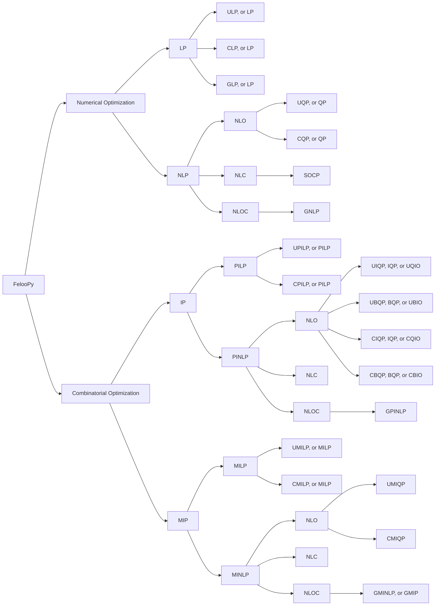
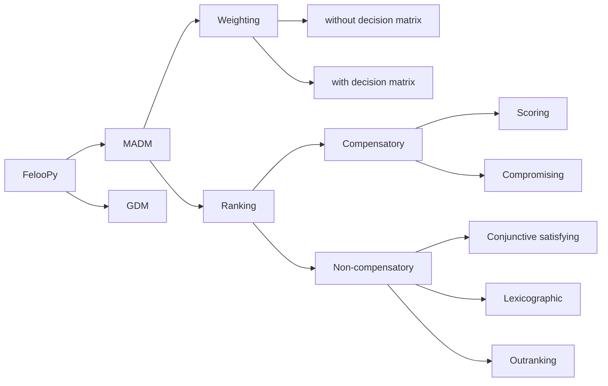

<p align="center">
   
</p>

## Introduction

**FelooPy** (pronounced /fɛlupaɪ/) is an **integrated optimization environment** (IOE) designed as a **decision optimization hub**. It involves the use of **automated operations research** (AutoOR) methods and techniques to identify **feasible solutions** that lead to **logical decisions** with the **optimal (best possible)** outcomes based on **given** or **learnable** policies. This Python library **simplifies** and **enhances** the use of **_existing_** and **_originally developed_** modeling, algorithm development, and analytical tools for decision-making within simulated **systems**, **industries**, and **supply chains**. FelooPy is an acronym alluding to an operations research scientist in pursuit of **fe**asible solutions, **lo**gical decisions, and **op**timal outcomes by optimization in **Py**thon. Additionally, it alludes to the concept of **loops** in computer programming and the **floppy disk**, symbolizing computing and memory efficiency. The development of FelooPy, which started in **September 2022**, continues under the **MIT license**.

Overview:


[](https://pepy.tech/project/feloopy?&left_text=totalusers)
[](https://pypistats.org/packages/feloopy)

[](https://feloopy.readthedocs.io/en/latest/?badge=latest&color=darkgreen)


Learn more:

[](https://www.linkedin.com/groups/12881077/) [](https://t.me/feloop_group)
[](https://instagram.com/feloop_page)

## Features

FelooPy supports the following _mathematical structure-based_ classification of optimization problems:

<details>
<summary>Display as a list</summary>

- Numerical optimization
   - Linear Programming (LP)
      - [Unconstrained] Linear Programming (ULP, or LP)
      - [Constrained] Linear Programming (CLP, or LP)
      - General Linear Programming (GLP, or LP)
   - Non-Linear Programming (NLP)
      - with non-linear objectives
         - [Unconstrained] Quadratic Programming (UQP, or QP)
         - [Constrained] Quadratic Programming (CQP, or QP)
      - with non-linear constraints
         - Second Order Cone Programming (SOCP)
      - with non-linear objectives and constraints
         - General Non-Linear Programming (GNLP)
- Combinatorial optimization
   - Integer Programming (IP)
      - Pure Integer Linear Programming (PILP)
         - [Unconstrained] Pure Integer Linear Programming (UPILP, or PILP)
         - [Constrained] Pure Integer Linear Programming (CPILP, or PILP)
      - Pure Integer Non-Linear Programming (PINLP)
         - with non-linear objectives
            - [Unconstrained] Integer Quadratic Programming (UIQP, IQP, or QUIO)
            - [Unconstrained] Binary Quadratic Programming (UBQP, BQP, or QUBO)
            - [Constrained] Integer Quadratic Programming (CIQP, IQP, or QUIO)
            - [Constrained] Binary Quadratic Programming (CBQP, BQP, or QUBO)
         - with non-linear constraints
         - with non-linear objectives and constraints
            - General Pure Integer Non-Linear Programming (GPINLP)
   - Mixed Integer Programming (MIP)
      - Mixed Integer Linear Programming (MILP)
         - [Unconstrained] Mixed Integer Linear Programming (UMILP, or MILP)
         - [Constrained] Mixed Integer Linear Programming (CMILP, or MILP)
      - Mixed Integer Non-Linear Programming (MINLP)
         - with non-linear objectives
            - [Unconstrained] Mixed Integer Quadratic Programming (UMIQP, or MIQP)
            - [Constrained] Mixed Integer Quadratic Programming (CMIQP, or MIQP)
         - with non-linear constraints
         - with non-linear objectives and constraints
            - General Mixed Integer Non-Linear Programming (GMINLP, or GMIP)

_Credit: Keivan Tafakkori_

</details>

<details>
<summary>Display as a graph</summary>



_Credit: Keivan Tafakkori_

</details>


FelooPy supports the following _expert-based_ classification of decision-making problems:

<details>
<summary>Display as a list</summary>

- Multi-Attribute Decision-Making (MADM)
   - Weighting methods
      - without a decision-making matrix
      - with a decision-making matrix
   - Ranking methods
      - Compensatory methods
         - Scoring methods
         - Compromising methods
      - Non-compensatory methods 
         - Conjunctive satisfying methods
         - Lexicographic methods
         - Outranking methods
         
- Group Decision-Making (GDM)

_Credit: Keivan Tafakkori_

</details>

<details>
<summary>Display as a graph</summary>


_Credit: Keivan Tafakkori_

</details>

## Installation

For a quick installation with a classic support of interfaces and solvers, you may use the `pip` package manager (please refer to this [link](https://pip.pypa.io/en/stable/installation/) to install, update, or get one) as follows:
   
   ```terminal
   pip install -U feloopy[stock]
   ```

However, as some users might prefer a dedicated version, the following lists the available variants of FelooPy:

<details>
<summary>Core variant</summary>

   This variant installs the base package without any additional features. It installs FelooPy with its common dependencies.

   ```terminal
   pip install -U feloopy
   ```
</details>

<details>
<summary>Free variants</summary>

   - `pico` variant:

      This variant installs the base package without any additional features. It is the same as the core variant. It installs FelooPy with its common dependencies.

      ```terminal
      pip install -U feloopy[pico]
      ```

   - `nano` variant:

      This variant includes a small set of additional features. It installs FelooPy with its common dependencies and the `pymprog` package. 

      ```terminal
      pip install -U feloopy[nano]
      ```

   - `micro` variant:

      This variant includes a moderate set of additional features. It installs FelooPy with its common dependencies and the `pymprog`, `gekko`, and `mealpy` packages.

      ```terminal
      pip install -U feloopy[micro]
      ```

   - `mini` variant:

      This variant includes a large set of additional features. It installs FelooPy with its common dependencies and the `pymprog`, `gekko`, `mealpy`, `ortools`, and `cvxpy` packages.

      ```terminal
      pip install -U feloopy[mini]
      ```   

   - `full` variant:

      This variant includes all available features. It installs FelooPy with its common dependencies and the `pymprog`, `gekko`, `mealpy`, `ortools`, `cvxpy`, `pymoo`, and `pydecision` packages.
      
      ```terminal
      pip install -U feloopy[full]
      ```

   - `stock` variant:

      This variant includes all interface packages. It installs FelooPy with its common dependencies and the `gekko`, `ortools`, `pulp`, `pyomo`, `pymprog`, `picos`, `linopy`, `cvxpy`, `mip`, `mealpy`, `pydecision`, `rsome`, `pymoo`, `niapy`, and `pygad` packages.

      ```terminal
      pip install -U feloopy[stock]
      ```

</details>

<details>
<summary>Commercial variants</summary>

   `plus_gurobi` variant:

   This variant includes the Gurobi solver. It requires a valid Gurobi license. Refer to the [Gurobi website](https://www.gurobi.com/) for more information.

   ```terminal
   pip install -U feloopy[plus_gurobi]
   ```

   `plus_cplex` variant:

   This variant includes the CPLEX solver. It requires a valid CPLEX license. Refer to the [CPLEX website](https://www.ibm.com/analytics/cplex-optimizer) for more information.

   ```terminal
   pip install -U feloopy[plus_cplex]
   ```

   `plus_xpress` variant:

   This variant includes the Xpress solver. It requires a valid Xpress license. Refer to the [Xpress website](https://www.fico.com/en/products/fico-xpress-optimization) for more information.

   ```terminal
   pip install -U feloopy[plus_xpress]
   ```

   `plus_copt` variant:

   This variant includes the COPT solver. It requires a valid COPT license. Refer to the [COPT website](https://shanshu.ai/copt) for more information.

   ```terminal
   pip install -U feloopy[plus_copt]
   ```

</details>

<details>
<summary>Non-compatible variants</summary>

   `only_cylp` variant:

   This variant includes the CyLP solver. It requires a valid CyLP installation. Refer to this [link](https://github.com/coin-or/CyLP) for more information.

   ```terminal
   pip install -U feloopy[plus_cylp]
   ```

   `only_linux` variant:

   This variant includes additional features for Linux-based distros. It installs FelooPy with its common dependencies and the `pymultiobjective` package.

   ```terminal
   pip install -U feloopy[only_linux]
   ```
</details>

<details>
<summary>Complete variants</summary>

   - `hyper` variant:

      This variant includes all interface and solver packages. It installs FelooPy with its common dependencies and the `gekko`, `ortools`, `pulp`, `pyomo`, `pymprog`, `picos`, `linopy`, `cvxpy`, `mip`, `mealpy`, `pydecision`, `rsome`, `pymoo`, `niapy`, `pygad`, `cplex`, `docplex`, `xpress`, `gurobipy`, `cylp`, and `coptpy` packages.

      ```terminal
      pip install -U feloopy[hyper]
      ```

   - `mega` variant:

      This variant includes all interface and solver packages. It installs a complete FelooPy with all its dependencies, regardless of whether they are compatible with your operating system, or not.

      ```terminal
      pip install -U feloopy[mega]
      ```
</details>

<details>
<summary>Dev variants</summary>

   To contribute to the project, support the developer with pull requests, and to get the latest updates, you can install a development variant as follows:

   ```terminal
   pip install -U git+https://github.com/ktafakkori/feloopy.git#egg=feloopy[variant_name]
   ```

   where `variant_name` is one of the above variants. (please refer to this [link](https://git-scm.com/downloads) to install, update, or get `git`.)

</details>

## Usage

- Quick start:

   <details>
   <summary>Exact optimization</summary>

   * _Note_ : Implementing this example at least requires installing the `feloopy[nano]` variant.

   ```python
   from feloopy import *

   # Define a model
   m = model('exact', 'target_model_name', 'pymprog')

   # Define variables
   x = m.bvar(name='x', dim=0)
   y = m.pvar(name='y', dim=0, bound = [0, 10])

   # Define constraints
   m.con(x + y <= 1, label='c1')
   m.con(x - y >= 1, label='c2')

   # Define an objective
   m.obj(x + y)

   # Solve the model
   m.sol(['max'], 'glpk')

   # Report the results
   m.report()
   ```

   <details>
   <summary style="color:green">Display the output</summary>

   ```terminal
   ╭─ FelooPy v0.2.8 ───────────────────────────────────────────────────────────────╮
   │                                                                                │
   │ Date: 2023-12-04                                                Time: 00:00:00 │
   │ Interface: pymprog                                                Solver: glpk │
   │                                                                                │
   ╰────────────────────────────────────────────────────────────────────────────────╯
   ╭─ Model ────────────────────────────────────────────────────────────────────────╮
   │                                                                                │
   │ Name: target_model_name                                                        │
   │ Feature:                                Class:                        Total:   │
   │ Positive variable                       1                             1        │
   │ Binary variable                         1                             1        │
   │ Total variables                         2                             2        │
   │ Objective                               -                             1        │
   │ Constraint                              2                             2        │
   │                                                                                │
   ╰────────────────────────────────────────────────────────────────────────────────╯
   ╭─ Solve ────────────────────────────────────────────────────────────────────────╮
   │                                                                                │
   │ Method: exact                                                  Objective value │
   │ Status:                                                                    max │
   │ optimal                                                                   1.00 │
   │                                                                                │
   ╰────────────────────────────────────────────────────────────────────────────────╯
   ╭─ Metric ───────────────────────────────────────────────────────────────────────╮
   │                                                                                │
   │ CPT (microseconds)                                                      347.00 │
   │ CPT (hour:min:sec)                                                    00:00:00 │
   │                                                                                │
   ╰────────────────────────────────────────────────────────────────────────────────╯
   ╭─ Decision ─────────────────────────────────────────────────────────────────────╮
   │                                                                                │
   │ x = 1.0                                                                        │
   │                                                                                │
   ╰────────────────────────────────────────────────────────────────────────────────╯
   ```
   </details>
   </details>

   <details>
   <summary>Heuristic optimization</summary>

   ```python

   from feloopy import *

   def instance(X):
      
      # Define model instance
      m = model('heuristic', 'representor_model_name', 'feloopy', X)

      # Define variables for the model instance
      x = m.bvar(name='x', dim=0)
      y = m.pvar(name='y', dim=0, bound = [0, 10])

      # Define constraints for the model instance
      m.con(x + y |l| 1, label='c1')
      m.con(x - y |g| 1, label='c2')

      # Define an objective for the model instance
      m.obj((x-1)**2+(y-1)**2)

      # Solve the model instance
      m.sol(['max'], 'ga', {'epoch': 1000, 'pop_size': 100})

      return m[X]

   # Make the main model
   m = make_model(instance)

   # Solve the model
   m.sol(penalty_coefficient=10)

   # Report the results
   m.report()
   ```

   <details>
   <summary style="color:green">Display the output</summary>

   ```terminal
   ╭─ FelooPy v0.2.8 ───────────────────────────────────────────────────────────────╮
   │                                                                                │
   │ Date: 2023-12-04                                                Time: 00:00:00 │
   │ Interface: feloopy                                                  Solver: ga │
   │                                                                                │
   ╰────────────────────────────────────────────────────────────────────────────────╯
   ╭─ Model ────────────────────────────────────────────────────────────────────────╮
   │                                                                                │
   │ Name: representor_model_name                                                   │
   │ Feature:                                Class:                        Total:   │
   │ Positive variable                       1                             1        │
   │ Binary variable                         1                             1        │
   │ Total variables                         2                             2        │
   │ Objective                               -                             1        │
   │ Constraint                              2                             2        │
   │                                                                                │
   ╰────────────────────────────────────────────────────────────────────────────────╯
   ╭─ Solve ────────────────────────────────────────────────────────────────────────╮
   │                                                                                │
   │ Method: heuristic                                              Objective value │
   │ Status:                                                                    max │
   │ feasible (constrained)                                                    1.00 │
   │                                                                                │
   ╰────────────────────────────────────────────────────────────────────────────────╯
   ╭─ Metric ───────────────────────────────────────────────────────────────────────╮
   │                                                                                │
   │ CPT (microseconds)                                                    1.31e+06 │
   │ CPT (hour:min:sec)                                                    00:00:01 │
   │                                                                                │
   ╰────────────────────────────────────────────────────────────────────────────────╯
   ╭─ Decision ─────────────────────────────────────────────────────────────────────╮
   │                                                                                │
   │ x = [1.]                                                                       │
   │                                                                                │
   ╰────────────────────────────────────────────────────────────────────────────────╯
   ```
   </details>
   </details>

   <details>
   <summary>Convex optimization</summary>

   * _Note_ : Implementing this example at least requires installing the `feloopy[mini]` variant.

   ```python
   from feloopy import *

   m = model('convex', 'convex_model_name', 'cvxpy')

   # Define variables
   x = m.ftvar(name='x',shape = 0)

   # Define constraints
   m.con(x <= 1, label='c1')
   m.con(x >= 1, label='c2')

   # Define an objective
   m.obj((x-4)**2)

   # Solve the model
   m.sol(['min'], 'ecos')

   # Report the results
   m.report()
   ```
   <details>
   <summary style="color:green">Display the output</summary>

   ```terminal
   ╭─ FelooPy v0.2.8 ───────────────────────────────────────────────────────────────╮
   │                                                                                │
   │ Date: 2023-12-04                                                Time: 00:00:00 │
   │ Interface: cvxpy                                                  Solver: ecos │
   │                                                                                │
   ╰────────────────────────────────────────────────────────────────────────────────╯
   ╭─ Model ────────────────────────────────────────────────────────────────────────╮
   │                                                                                │
   │ Name: convex_model_name                                                        │
   │ Feature:                                Class:                        Total:   │
   │ Free variable                           1                             1        │
   │ Total variables                         1                             1        │
   │ Objective                               -                             1        │
   │ Constraint                              2                             2        │
   │                                                                                │
   ╰────────────────────────────────────────────────────────────────────────────────╯
   ╭─ Solve ────────────────────────────────────────────────────────────────────────╮
   │                                                                                │
   │ Method: convex                                                 Objective value │
   │ Status:                                                                    min │
   │ optimal                                                                   9.00 │
   │                                                                                │
   ╰────────────────────────────────────────────────────────────────────────────────╯
   ╭─ Metric ───────────────────────────────────────────────────────────────────────╮
   │                                                                                │
   │ CPT (microseconds)                                                    1.06e+04 │
   │ CPT (hour:min:sec)                                                    00:00:00 │
   │                                                                                │
   ╰────────────────────────────────────────────────────────────────────────────────╯
   ╭─ Decision ─────────────────────────────────────────────────────────────────────╮
   │                                                                                │
   │ x = 1.000000005186514                                                          │
   │                                                                                │
   ╰────────────────────────────────────────────────────────────────────────────────╯
   ```
   </details>
   </details>

   <details>
   <summary>Constraint optimization</summary>

   * _Note_ : Implementing this example at least requires installing the `feloopy[mini]` variant.

   ```python
   from feloopy import *

   m = model('constraint', 'satisfaction_model_name', 'ortools_cp')

   # Define variables
   x = m.bvar(name='x', dim=0)
   y = m.ivar(name='y', dim=0, bound = [0, 10])

   # Define constraints
   m.con(x + y <= 1, label='c1')
   m.con(x - y >= 1, label='c2')

   # Define an objective
   m.obj(x + y)

   # Solve the model
   m.sol(['max'], 'ortools')

   # Report the results
   m.report()
   ```
   <details>
   <summary style="color:green">Display the output</summary>

   ```terminal
   ╭─ FelooPy v0.2.8 ───────────────────────────────────────────────────────────────╮
   │                                                                                │
   │ Date: 2023-12-04                                                Time: 00:00:00 │
   │ Interface: ortools_cp                                          Solver: ortools │
   │                                                                                │
   ╰────────────────────────────────────────────────────────────────────────────────╯
   ╭─ Model ────────────────────────────────────────────────────────────────────────╮
   │                                                                                │
   │ Name: satisfier_model_name                                                     │
   │ Feature:                                Class:                        Total:   │
   │ Binary variable                         1                             1        │
   │ Integer variable                        1                             1        │
   │ Total variables                         2                             2        │
   │ Objective                               -                             1        │
   │ Constraint                              2                             2        │
   │                                                                                │
   ╰────────────────────────────────────────────────────────────────────────────────╯
   ╭─ Solve ────────────────────────────────────────────────────────────────────────╮
   │                                                                                │
   │ Method: constraint                                             Objective value │
   │ Status:                                                                    max │
   │ optimal                                                                   1.00 │
   │                                                                                │
   ╰────────────────────────────────────────────────────────────────────────────────╯
   ╭─ Metric ───────────────────────────────────────────────────────────────────────╮
   │                                                                                │
   │ CPT (microseconds)                                                    3.65e+04 │
   │ CPT (hour:min:sec)                                                    00:00:00 │
   │                                                                                │
   ╰────────────────────────────────────────────────────────────────────────────────╯
   ╭─ Decision ─────────────────────────────────────────────────────────────────────╮
   │                                                                                │
   │ x = 1                                                                          │
   │                                                                                │
   ╰────────────────────────────────────────────────────────────────────────────────╯
   ```
   </details>
   </details>


   <details>
   <summary>Multi-objective optimization</summary>

   * _Note_ : Implementing this example at least requires installing the `feloopy[full]` variant.

   ```python
   from feloopy import *

   def instance(X):
      
      m = model('heuristic','representor_model_name','pymoo', X)
      
      x = m.pvar(name = 'x', dim = [2], bound = [-1000,1000])
      
      m.obj(x[...,0]**2 + x[...,1]**2)
      m.obj((x[...,0]-2)**2 + (x[...,1]-2)**2)
      
      m.sol(['min','min'], 'ns-ga-ii', {'n_gen': 100}, obj_id='all')

      return m[X]

   m = make_model(instance)
   m.sol()
   m.report()
   ```

   <details>
   <summary style="color:green">Display the output</summary>

   ```terminal
   ╭─ FelooPy v0.2.8 ───────────────────────────────────────────────────────────────╮
   │                                                                                │
   │ Date: 2023-12-04                                                Time: 00:00:00 │
   │ Interface: pymoo                                              Solver: ns-ga-ii │
   │                                                                                │
   ╰────────────────────────────────────────────────────────────────────────────────╯
   ╭─ Model ────────────────────────────────────────────────────────────────────────╮
   │                                                                                │
   │ Name: representor_model_name                                                   │
   │ Feature:                                Class:                        Total:   │
   │ Positive variable                       1                             2        │
   │ Total variables                         1                             2        │
   │ Objective                               -                             2        │
   │                                                                                │
   ╰────────────────────────────────────────────────────────────────────────────────╯
   ╭─ Solve ────────────────────────────────────────────────────────────────────────╮
   │                                                                                │
   │ Method: heuristic                                              Objective value │
   │ Status:                                                          min       min │
   │ feasible (unconstrained)                                        0.00      7.83 │
   │ feasible (unconstrained)                                        7.94      0.00 │
   │ feasible (unconstrained)                                        0.00      7.70 │
   │ feasible (unconstrained)                                        0.08      6.82 │
   │ feasible (unconstrained)                                        2.50      1.57 │
   │ feasible (unconstrained)                                        3.53      0.91 │
   │ feasible (unconstrained)                                        0.70      4.01 │
   │ feasible (unconstrained)                                        0.30      5.26 │
   │ feasible (unconstrained)                                        2.38      1.72 │
   │ feasible (unconstrained)                                        5.17      0.31 │
   │ feasible (unconstrained)                                        2.02      1.99 │
   │ feasible (unconstrained)                                        6.78      0.05 │
   │ feasible (unconstrained)                                        0.63      4.18 │
   │ feasible (unconstrained)                                        5.63      0.22 │
   │ feasible (unconstrained)                                        3.91      0.72 │
   │ feasible (unconstrained)                                        1.28      2.96 │
   │ feasible (unconstrained)                                        1.06      3.46 │
   │ feasible (unconstrained)                                        5.42      0.25 │
   │ feasible (unconstrained)                                        2.62      1.50 │
   │ feasible (unconstrained)                                        0.58      4.28 │
   │ feasible (unconstrained)                                        6.28      0.11 │
   │ feasible (unconstrained)                                        6.14      0.15 │
   │ feasible (unconstrained)                                        0.26      5.39 │
   │ feasible (unconstrained)                                        0.36      5.07 │
   │ feasible (unconstrained)                                        3.42      0.98 │
   │ feasible (unconstrained)                                        2.96      1.23 │
   │ feasible (unconstrained)                                        1.18      3.19 │
   │ feasible (unconstrained)                                        3.69      0.83 │
   │ feasible (unconstrained)                                        1.54      2.53 │
   │ feasible (unconstrained)                                        4.49      0.50 │
   │ feasible (unconstrained)                                        1.77      2.25 │
   │ feasible (unconstrained)                                        2.15      1.88 │
   │ feasible (unconstrained)                                        0.18      5.85 │
   │ feasible (unconstrained)                                        0.20      5.70 │
   │ feasible (unconstrained)                                        3.76      0.79 │
   │ feasible (unconstrained)                                        1.47      2.61 │
   │ feasible (unconstrained)                                        4.63      0.46 │
   │ feasible (unconstrained)                                        6.45      0.10 │
   │ feasible (unconstrained)                                        6.97      0.04 │
   │ feasible (unconstrained)                                        7.35      0.01 │
   │ feasible (unconstrained)                                        3.30      1.03 │
   │ feasible (unconstrained)                                        3.06      1.18 │
   │ feasible (unconstrained)                                        0.42      4.80 │
   │ feasible (unconstrained)                                        5.30      0.28 │
   │ feasible (unconstrained)                                        5.78      0.21 │
   │ feasible (unconstrained)                                        2.30      1.78 │
   │ feasible (unconstrained)                                        0.97      3.72 │
   │ feasible (unconstrained)                                        0.85      3.75 │
   │ feasible (unconstrained)                                        4.82      0.42 │
   │ feasible (unconstrained)                                        1.83      2.18 │
   │ feasible (unconstrained)                                        7.20      0.02 │
   │ feasible (unconstrained)                                        1.14      3.32 │
   │ feasible (unconstrained)                                        5.98      0.17 │
   │ feasible (unconstrained)                                        7.73      0.00 │
   │ feasible (unconstrained)                                        2.85      1.32 │
   │ feasible (unconstrained)                                        1.62      2.42 │
   │ feasible (unconstrained)                                        0.77      3.91 │
   │ feasible (unconstrained)                                        4.24      0.59 │
   │ feasible (unconstrained)                                        4.99      0.38 │
   │ feasible (unconstrained)                                        0.49      4.54 │
   │ feasible (unconstrained)                                        5.90      0.19 │
   │ feasible (unconstrained)                                        0.11      6.39 │
   │ feasible (unconstrained)                                        0.09      6.75 │
   │ feasible (unconstrained)                                        0.09      6.58 │
   │ feasible (unconstrained)                                        0.52      4.44 │
   │ feasible (unconstrained)                                        7.08      0.03 │
   │ feasible (unconstrained)                                        1.42      2.73 │
   │ feasible (unconstrained)                                        1.67      2.36 │
   │ feasible (unconstrained)                                        0.16      5.98 │
   │ feasible (unconstrained)                                        0.12      6.19 │
   │ feasible (unconstrained)                                        3.15      1.11 │
   │ feasible (unconstrained)                                        2.20      1.84 │
   │ feasible (unconstrained)                                        1.94      2.07 │
   │ feasible (unconstrained)                                        7.51      0.01 │
   │ feasible (unconstrained)                                        0.46      4.65 │
   │ feasible (unconstrained)                                        1.35      2.84 │
   │ feasible (unconstrained)                                        4.75      0.44 │
   │ feasible (unconstrained)                                        6.60      0.07 │
   │ feasible (unconstrained)                                        7.57      0.01 │
   │ feasible (unconstrained)                                        0.77      3.82 │
   │ feasible (unconstrained)                                        3.20      1.08 │
   │ feasible (unconstrained)                                        1.91      2.11 │
   │ feasible (unconstrained)                                        0.37      4.96 │
   │ feasible (unconstrained)                                        4.98      0.38 │
   │ feasible (unconstrained)                                        2.71      1.40 │
   │ feasible (unconstrained)                                        0.11      6.28 │
   │ feasible (unconstrained)                                        0.99      3.56 │
   │ feasible (unconstrained)                                        7.84      0.00 │
   │ feasible (unconstrained)                                        0.10      6.51 │
   │ feasible (unconstrained)                                        0.23      5.54 │
   │ feasible (unconstrained)                                        2.80      1.35 │
   │ feasible (unconstrained)                                        1.29      2.91 │
   │ feasible (unconstrained)                                        0.99      3.60 │
   │ feasible (unconstrained)                                        4.04      0.67 │
   │ feasible (unconstrained)                                        0.43      4.72 │
   │ feasible (unconstrained)                                        6.59      0.09 │
   │ feasible (unconstrained)                                        4.36      0.55 │
   │ feasible (unconstrained)                                        1.40      2.78 │
   │ feasible (unconstrained)                                        4.37      0.54 │
   │ feasible (unconstrained)                                        4.12      0.64 │
   │ payoff 0                                                        0.00      7.83 │
   │ payoff 1                                                        7.94      0.00 │
   │ max                                                             7.94      7.83 │
   │ ave                                                             2.90      2.40 │
   │ std                                                             2.42      2.20 │
   │ min                                                             0.00      0.00 │
   │                                                                                │
   ╰────────────────────────────────────────────────────────────────────────────────╯
   ╭─ Metric ───────────────────────────────────────────────────────────────────────╮
   │                                                                                │
   │ CPT (microseconds)                                                    1.58e+06 │
   │ CPT (hour:min:sec)                                                    00:00:01 │
   │                                                                                │
   ╰────────────────────────────────────────────────────────────────────────────────╯
   ╭─ Decision ─────────────────────────────────────────────────────────────────────╮
   │                                                                                │
   │ x[0] = [0.028609389086682313, 1.9859341076320334]                              │
   │ x[1] = [0.006622432714834758, 1.9993559166051682]                              │
   │                                                                                │
   ╰────────────────────────────────────────────────────────────────────────────────╯
   ```
   </details>
   </details>

   <details>
   <summary>Multi-attribute decision-making</summary>

   * _Note_ : Implementing this example at least requires installing the `feloopy[mini]` variant.

   ```python
   from feloopy import *

   m = madm('ahp','ahp_model', 'pydecision')

   m.add_cpcm([
   [1  ,   1/3,   1/5,   1  ,   1/4,   1/2,   3  ],   
   [3  ,   1  ,   1/2,   2  ,   1/3,   3  ,   3  ],  
   [5  ,   2  ,   1  ,   4  ,   5  ,   6  ,   5  ],   
   [1  ,   1/2,   1/4,   1  ,   1/4,   1  ,   2  ],   
   [4  ,   3  ,   1/5,   4  ,   1  ,   3  ,   2  ],   
   [2  ,   1/3,   1/6,   1  ,   1/3,   1  ,   1/3],   
   [1/3,   1/3,   1/5,   1/2,   1/2,   3  ,   1  ]   
   ])

   m.sol()
   m.report(show_tensors=True)
   ```

   <details>
   <summary style="color:green">Display the output</summary>

   ╭─ FelooPy v0.2.8 ───────────────────────────────────────────────────────────────╮
   │                                                                                │
   │ Date: 2023-12-04                                                Time: 02:09:39 │
   │ Interface: pydecision                                       Solver: ahp_method │
   │                                                                                │
   ╰────────────────────────────────────────────────────────────────────────────────╯
   ╭─ Model ────────────────────────────────────────────────────────────────────────╮
   │                                                                                │
   │ Name: ahp_model                                                                │
   │ cpm_defined                                                                    │
   │ Number of criteria:                                                          7 │
   │                                                                                │
   ╰────────────────────────────────────────────────────────────────────────────────╯
   ╭─ Solve ────────────────────────────────────────────────────────────────────────╮
   │                                                                                │
   │ Method: ahp_method                                                             │
   │ Status: feasible (solved)                                                      │
   │                                                                                │
   ╰────────────────────────────────────────────────────────────────────────────────╯
   ╭─ Metric ───────────────────────────────────────────────────────────────────────╮
   │                                                                                │
   │ Inconsistency:                                                          0.1094 │
   │ CPT (microseconds):                                                        228 │
   │ CPT (hour:min:sec):                                                   00:00:00 │
   │                                                                                │
   ╰────────────────────────────────────────────────────────────────────────────────╯
   ╭─ Decision ─────────────────────────────────────────────────────────────────────╮
   │                                                                                │
   │ wv = [0.072 , 0.1518, 0.3668, 0.0734, 0.2064, 0.0612, 0.0685]                  │
   │                                                                                │
   ╰────────────────────────────────────────────────────────────────────────────────╯
   ```
   </details>
   </details>

## Citation

To cite or give credit to FelooPy in publications, projects, presentations, web pages, blog posts, etc. please use the following entries:

- LaTeX:

   ```bibtex
   @software{ktafakkori2022Sep,
   author       = {Keivan Tafakkori},
   title        = {{FelooPy: An integrated optimization environment for AutoOR in Python}},
   year         = {2022},
   month        = sep,
   publisher    = {GitHub},
   url          = {https://github.com/ktafakkori/feloopy/}
   }
   ```

- APA:

   <div style="white-space: pre-wrap;">
   Tafakkori, K. (2022). FelooPy: An integrated optimization environment for AutoOR in Python [Python Library]. Retrieved from https://github.com/ktafakkori/feloopy (Original work published September 2022).
   </div>

- In-text:

   * _Note_ 1: Please write the version you used, the latest is v0.2.8.
   * _Note_ 2: Using secondary interfaces or solvers might also require a citation to their projects.

   FelooPy (v0.2.8) was used in conjunction with [interface x] (v0.0.0) (except `feloopy` itself) as the optimization interface and [solver y] (v0.0.0) as the optimization solver.

## License

      Copyright K. Tafakkori, 2022-2024
      See the LICENSE file for copyright information.
