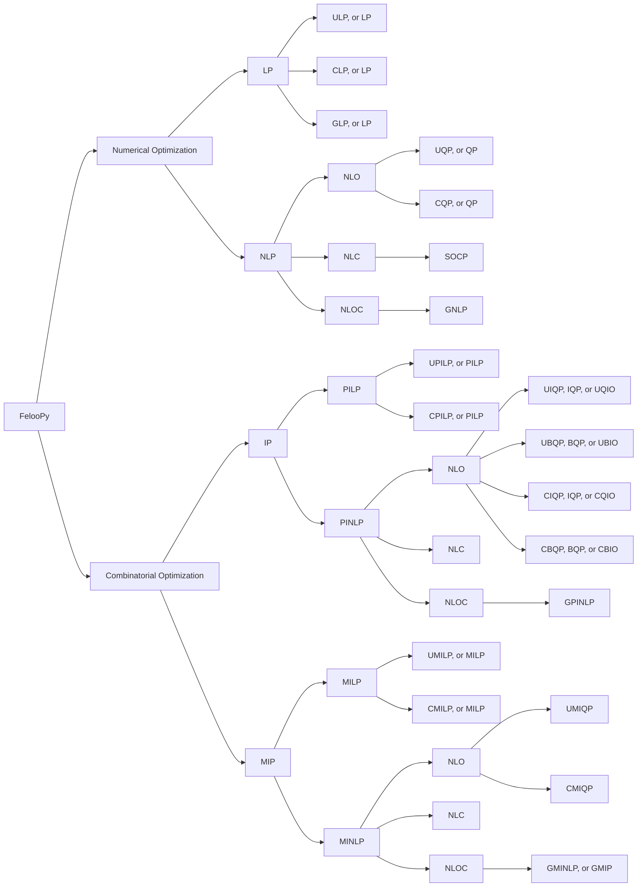
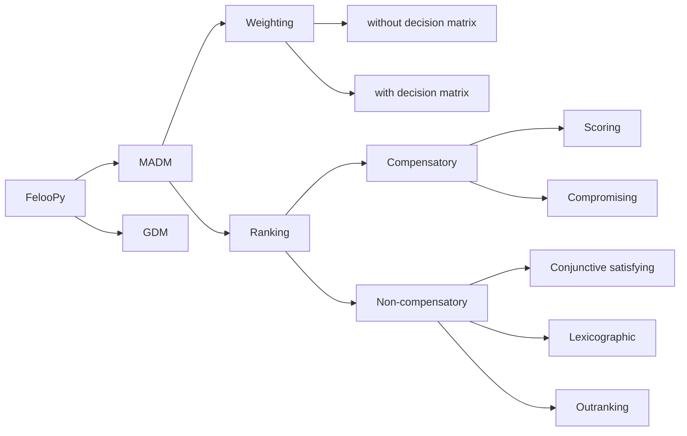

#


<h2 align='center'>Efficient & Feature-Rich Integrated Optimization Environment</h2>

<center>

[](https://github.com/ktafakkori/feloopy/stargazers)
[](https://github.com/ktafakkori/feloopy/network/members)
[](https://github.com/ktafakkori/feloopy/releases)
[](https://pepy.tech/project/feloopy)
[](https://github.com/ktafakkori/feloopy/blob/main/LICENSE)

</center>

FelooPy (pronounced /fɛlupaɪ/) is a comprehensive and versatile Decision Science and Operations Research library. It allows for coding, modeling, and solving decision problems and aligns with low or no-code requirements, letting you focus more on analytics. The library covers various categories of mathematical and statistical methods for decision-making and utilizes numerous interfaces and solvers without requiring prompting large language models or learning complex coding syntaxes. It is primarily developed in Python, which makes it accessible and callable from multiple programming languages.

## Key features

- Efficient: Optimized for speed, designed with Python in mind.
- Integrated: Seamlessly integrates with any interface and solver for optimization, making switching easy.
- Versatile: Covers linear, nonlinear, integer, mixed-integer, mixed-integer nonlinear programming.
- Intuitive: Code as mathematically modeled; no advanced programming knowledge is needed.
- Automated: Configure your solution method and let FelooPy handle the rest.

## Motivation

- To increase the applicability of operations research in solving real-world problems.
- To focus more on analyzing impact and importance than solving, modeling, or coding.
- To reduce the need to prompt large language models and seek coding suggestions.
- To focus more on stability and scalability than feasibility, logicality, or optimality.
- To have an all-in-one integrated optimization environment for decision analytics.
- To enable benchmarking of various policies, models, solvers, methods, and algorithms.

## Example

```py
import feloopy as flp

m = flp.model("exact", "model_name", "pymprog")

x = m.bvar(name="x")
y = m.pvar(name="y", bound=[0, 1])
m.con(x + y <= 1, name="c1")
m.con(x - y >= 1, name="c2")
m.obj(x + y)

m.sol(["max"], "glpk")

m.report()
```

FelooPy supports the following _mathematical structure-based_ classification of optimization problems:

- Numerical optimization
   - Linear Programming (LP)
      - [Unconstrained] Linear Programming (ULP, or LP)
      - [Constrained] Linear Programming (CLP, or LP)
      - General Linear Programming (GLP, or LP)
   - Nonlinear Programming (NLP)
      - with nonlinear objectives
         - [Unconstrained] Quadratic Programming (UQP, or QP)
         - [Constrained] Quadratic Programming (CQP, or QP)
      - with nonlinear constraints
         - Second Order Cone Programming (SOCP)
      - with nonlinear objectives and constraints
         - General Nonlinear Programming (GNLP)
- Combinatorial optimization
   - Integer Programming (IP)
      - Pure Integer Linear Programming (PILP)
         - [Unconstrained] Pure Integer Linear Programming (UPILP, or PILP)
         - [Constrained] Pure Integer Linear Programming (CPILP, or PILP)
      - Pure Integer Nonlinear Programming (PINLP)
         - with nonlinear objectives
            - [Unconstrained] Integer Quadratic Programming (UIQP, IQP, or QUIO)
            - [Unconstrained] Binary Quadratic Programming (UBQP, BQP, or QUBO)
            - [Constrained] Integer Quadratic Programming (CIQP, IQP, or QUIO)
            - [Constrained] Binary Quadratic Programming (CBQP, BQP, or QUBO)
         - with nonlinear constraints
         - with nonlinear objectives and constraints
            - General Pure Integer Nonlinear Programming (GPINLP)
   - Mixed Integer Programming (MIP)
      - Mixed Integer Linear Programming (MILP)
         - [Unconstrained] Mixed Integer Linear Programming (UMILP, or MILP)
         - [Constrained] Mixed Integer Linear Programming (CMILP, or MILP)
      - Mixed Integer Nonlinear Programming (MINLP)
         - with nonlinear objectives
            - [Unconstrained] Mixed Integer Quadratic Programming (UMIQP, or MIQP)
            - [Constrained] Mixed Integer Quadratic Programming (CMIQP, or MIQP)
         - with nonlinear constraints
         - with nonlinear objectives and constraints
            - General Mixed Integer Nonlinear Programming (GMINLP, or GMIP)




FelooPy supports the following _expert-based_ classification of decision-making problems:

- Multi-Attribute Decision-Making (MADM)
   - Weighting methods
      - without a decision-making matrix
      - with a decision-making matrix
   - Ranking methods
      - Compensatory methods
         - Scoring methods
         - Compromising methods
      - Non-compensatory methods
         - Conjunctive satisfying methods
         - Lexicographic methods
         - Outranking methods

- Group Decision-Making (GDM)




## License

FelooPy is licensed based on the [MIT license](https://github.com/ktafakkori/feloopy/blob/main/LICENSE).
