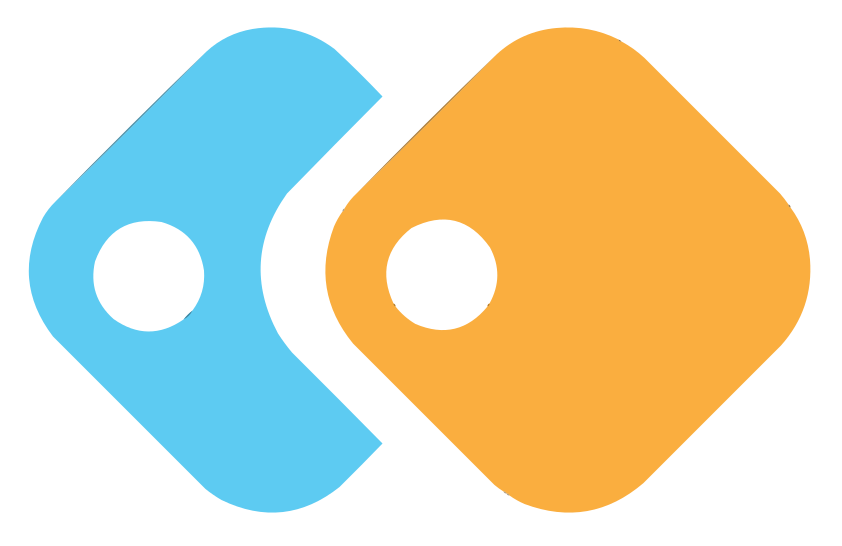

Welcome to FelooPy's documentation!
=======================================

.. toctree::
   :maxdepth: 2
   :caption: Contents:

##############################
Introduction
##############################

FelooPy
-------

FelooPy (pronounced /fɛlupaɪ/) is a free and open-source Python library for automated operations research that serves as both a hyper-optimization interface and an integrated optimization environment. The name comes from the idea of suggesting practical and applicable solutions for systems, industries, and supply chains, and it also references the importance of loops in programming and algorithm development, and draws similarities to the name "Floppy" to highlight memory efficiency. FelooPy helps operations research scientists achieve their goals using various target, representor, and learner models. In simple words, FelooPy is a unified framework for optimization algorithms, decision-making methods, and modeling and analytical tools.

News
----

🎉 *Version 0.2.5 is out: Added new features!* 🎉

##############################
Installation
##############################

FelooPy can be installed on Linux-based distributions, Windows, or macOS. It has a few dependencies that should work on all these platforms.

Quick Installation
------------------

.. code-block:: bash

   pip install --upgrade feloopy

PyPI Installation
-----------------

.. code-block:: bash

   pip install feloopy==0.2.5

Command Installation
--------------------

.. code-block:: bash

   !pip install feloopy==0.2.5

Script Installation
-------------------

.. code-block:: python

   import pip

   def install(package):
     if hasattr(pip, 'main'):
       pip.main(['install','-U', package])
     else:
       pip._internal.main(['install','-U', package])

   install('feloopy==0.2.5')

Local Installation
------------------

1. Download the `feloopy-0.2.5.zip`_ file.
2. Extract it into a specific directory.
3. Open a terminal in that directory.

.. code-block:: bash

   pip install .

Colab Installation
------------------

1. Run this cell and reload (CTRL + R) (using "py310" or "py311"):

.. code-block:: bash

   !wget https://github.com/korakot/kora/releases/download/v0.10/py310.sh
   !bash ./py310.sh -b -f -p /usr/local
   !python -m ipykernel install --name "py310" --user

2. Run this cell and reload (CTRL + R):

.. code-block:: bash

   !pip install feloopy==0.2.5

Git Installation
----------------

.. code-block:: bash

   pip install -U git+https://github.com/ktafakkori/feloopy

.. _feloopy-0.2.5.zip: https://example.com/feloopy-0.2.5.zip

##############################
Features
##############################

FelooPy offers the following key features:

Simplest optimization programming language
   Designed to be easy to use, even for those with little or no programming experience.

Modeling, solving and analyzing optimization problems
   Provides a complete suite of tools for modeling, solving and analyzing a wide range of optimization problems.

Exact optimization algorithms
   Supports *107* exact optimization algorithms that guarantee the optimal solution to your problem.

Heuristic optimization algorithms 
   Supports *197* heuristic optimization algorithms that can find best possible solutions to complex problems.

Convex optimization algorithms
   Supports *20* convex optimization algorithms that ease tensor- and matrix-form modeling, primarily for convex problems.

Constraint optimization algorithms
   Supports *2* constraint optimization algorithms that can handle a wide range of complex constraints for operational and time-dependent decisions.

Multi-objective optimization algorithms
   Supports *17* multi-objective optimization algorithms, in which objectives might be conflicting or with different numerical units.

Multi-critera decision-making methods
   Supports *41* MCDM algorithms to solve decision problems with expert-based inputs without mathematical modeling.

Solver configurations
   Lets you configure the solver to meet specific requirements.

Auto-encoders for general purpose programming
   Provides auto-encoders to simplify general-purpose programming tasks.

Auto-linearizers for linear programming conversions
   Provides auto-linearizers that can handle mixed-integer non-linear programming problems.

Auto-logic for modeling special constraints
   Provides auto-logic to help you model and solve problems with special constraints.

Auto-sensitivity for analyzing the impact of key parameters
   Provides auto-sensitivity tools to help you analyze the impact of key parameters on your optimization problem.

##############################
Contributions
##############################

We welcome your contributions to this project. This includes reporting bugs, submitting pull requests, testing changes, and providing examples. 

##############################
Support FelooPy
##############################

We are committed to continuing the development of FelooPy and would greatly appreciate your support. You can help us by:

- ⭐️ Starring the project on GitHub: Your stars motivate us to keep improving FelooPy. You can star the project [here](https://github.com/ktafakkori/feloopy/stargazers).

- 🍴 Forking the project on GitHub: You can also contribute to FelooPy by forking the project [here](https://github.com/ktafakkori/feloopy/network/members).

- 💰 Making a donation: Your donations help to sustain and maintain the project and add new features. If you would like to support us, please visit our [support page](https://ktafakkori.github.io/support/).

##############################
Citation
##############################

If you use FelooPy in your research or project, please consider citing it as follows:

.. code-block:: bibtex

   @software{ktafakkori2022Sep,
     author       = {Keivan Tafakkori},
     title        = {{FelooPy: An integrated optimization environment for AutoOR in Python}},
     year         = {2022},
     month        = sep,
     publisher    = {GitHub},
     url          = {https://github.com/ktafakkori/feloopy/}
   }

This will help others discover and make use of FelooPy, and it will also give credit to its contributors and maintainers.

##############################
License
##############################

FelooPy is released under the MIT License. Read the [LICENSE](https://github.com/ktafakkori/feloopy/blob/main/LICENSE) file for more information.
