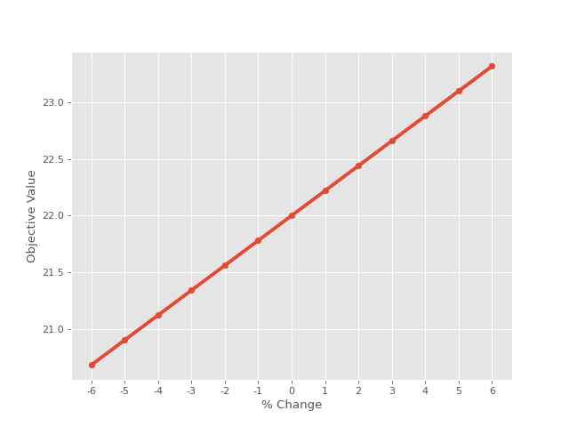

# How to model and solve an optimization problem with FelooPy?

1. Import the `feloopy` package.

```python
from feloopy import *
```

2. Define environment.

* Note 1: As you start typing the name of a function e.g., `function` and opening the first parenthesis `function(`, FelooPy would help you to define the function arguments, only if the used IDE supports (e.g., spyder or VSC).

* Note 2: Instead of `ortools`, you might use the other optimization interfaces of your choice.

```python
from feloopy import *

#Environment
m = model('exact', 'tsp', 'ortools')

```

2. Define sets and datasets.

```python

#Sets
N = m.set(10) #Cities
U = m.set(9) #Artificial variables

#(OR)

N = range(10)
U = range(9)

#Parameters
c = m.uniformint(1, 10, [N,N])

for i, j in sets(N, N):
    c[i][i] = 0
    c[i][j] = c[j][i]

```

3. Define decision variables.

```python

# Variables
x = m.bvar('x', [N, N])
u = m.ivar('u', [N])
```

4. Define optimization model.


```python
# Objective
m.obj(sum(c[i, j]*x[i, j] for i, j in sets(N, N)))

# Constraints
for j in N:
    m.con(sum(x[i, j] for i in N if i != j) |e| 1)

for i in N:
    m.con(sum(x[i, j] for j in N if j != i) |e| 1)

for i, j in sets(U, N):
    if i != j:
        m.con(u[i] - u[j] + x[i, j] * len(N) |l| len(N)-1)
```


4. Define solve command.

```python
# Solve
m.sol(['min'], 'scip')

```

5. Define display command.

```python

m.inf()
m.dis_obj()
m.dis_status()

# Display
for i, j in sets(N, N):
    if m.get(x[i, j]) == 1:
        print(f"when the traveler is at {i} goes to {j}")
```
5. Output


```
~~~~~~~~~~~~~~~~~~~~~~~~~~~~~~~~~~~~~~~~~~~~~~~~~~~~~~~~~~
   FelooPy (Version 0.2.0) - Released: 12 December 2022
~~~~~~~~~~~~~~~~~~~~~~~~~~~~~~~~~~~~~~~~~~~~~~~~~~~~~~~~~~


PROBLEM FEATURES
 --------
| info      | detail   | variable   | count (cat,tot)   | other      | count (cat, tot)   |
|-----------|----------|------------|-------------------|------------|--------------------|
| model     | tsp      | positive   | [0, 0]            | objective  | [1, 1]             |
| interface | ortools  | binary     | [1, 100]          | constraint | [101, 101]         |
| solver    | scip     | integer    | [1, 10]           |            |                    |
| direction | ['min']  | free       | [0, 0]            |            |                    |
| method    | exact    | tot        | [2, 110]          |            |                    |

objective:  25.0
status:  optimal

when the traveler is at 0 goes to 2
when the traveler is at 1 goes to 5
when the traveler is at 2 goes to 8
when the traveler is at 3 goes to 4
when the traveler is at 4 goes to 1
when the traveler is at 5 goes to 6
when the traveler is at 6 goes to 9
when the traveler is at 7 goes to 0
when the traveler is at 8 goes to 3
when the traveler is at 9 goes to 7
```

# How to do a sensitivity analysis?

1. Put the modeling environemnt inside a function.

* Note: This function gets the desired parameters and returns the model object.

```python
from feloopy import *

N = range(10)
U = range(9)

np.random.seed(0)
c = np.random.randint(1, 10, size=(len(N), len(N)))

def tsp(c):

    # Environment
    m = model('exact', 'tsp', 'ortools',Key=0) 
    for i, j in sets(N, N):
        c[i][i] = 0
        c[i][j] = c[j][i]

    # Variables
    x = m.bvar('x', [N, N])
    u = m.ivar('u', [N])

    # Objective
    m.obj(sum(c[i, j]*x[i, j] for i, j in sets(N, N)))

    # Constraints
    for j in N:
        m.con(sum(x[i, j] for i in N if i != j) |e| 1)

    for i in N:
        m.con(sum(x[i, j] for j in N if j != i) |e| 1)

    for i, j in sets(U, N):
        if i != j:
            m.con(u[i] - u[j] + x[i, j] * len(N) |l| len(N)-1)

    # Solve
    m.sol(['min'], 'scip')

    return m
```

2. Define the sensitivity anlayser.

* This code generates a table:

```python
sensitivity(tsp, [c], [-6,6],Table=True)
```

Output:

```
SENSITIVITY ANALYSIS (PARAM: 1)
 --------
|   % change |   objective value |
|------------|-------------------|
|         -6 |             20.68 |
|         -5 |             20.9  |
|         -4 |             21.12 |
|         -3 |             21.34 |
|         -2 |             21.56 |
|         -1 |             21.78 |
|          0 |             22    |
|          1 |             22.22 |
|          2 |             22.44 |
|          3 |             22.66 |
|          4 |             22.88 |
|          5 |             23.1  |
|          6 |             23.32 |

```

* This code generates a table and a figure.

```python
sensitivity(tsp, [c], [-6,6],Table=True, Plot=True)
```

Output:

<p align="center">
  
</p>


# How to use heuristic optimization solvers?

1. Create your model inside a function.

* Note 1: This function gets a search agent and returns the objective value.
* Note 2: Notice that the decision variables here are indexed either as `x[i]`,`x[i,j]` (for `mealpy` and non-vectorized interfaces) or `x[:,i]`, `x[:,i,j]` for vectorized interfaces (i.e., the `feloopy` interface itself).
* Note 3: Notice that instead of `|l|`, `|e|`, and `|g|` or `<=`, `==`, and `>=`, herein you should only use `|ll|` or `|gg|`.

```python
from feloopy import *

# Sets
J = range(7)  # Set of the items

# Parameters
w = [40, 50, 30, 10, 10, 40, 30]  # Weight of the items
W = 100  # Capacity of the knapsack
p = [40, 60, 10, 10, 3, 20, 60]  # Value of the items

def instance(X):

    # Environment
    m = model('heuristic', 'kp', 'mealpy',AgentProperties=X)

    # Variables
    x = m.bvar('x', [J])

    # Objective
    m.obj(sum(p[j]*x[j] for j in J))

    # Constraints
    m.con(sum(w[j]*x[j] for j in J) |ll| W)

    # Solve
    m.sol(['max'], 'BaseSMA', {'epoch': 100, 'pop_size': 10})

    return m[X]
```
2. Define implementor.

```python
m = implement(instance)

m.sol(PenaltyMultiplier=150,Times=10)
m.inf()
m.dis_obj()

# Display
for j in J:
    print(f"item {j} is {m.get(['x',(j,)])}")
```

Output:

```
Output:

TIME
 --------
| cpt (ave)   | cpt (std)         | unit      |
|-------------|-------------------|-----------|
| 775322.9    | 99388.31470796755 | micro sec |
| 00:00:00    | 00:00:00          | h:m:s     |

OBJ
 --------
|   obj | unit               |
|-------|--------------------|
|   133 | max                |
|   133 | average            |
|     0 | standard deviation |
|   133 | min                |


~~~~~~~~~~~~~~~~~~~~~~~~~~~~~~~~~~~~~~~~~~~~~~~~~~~~~~~~~~
   FelooPy (Version 0.2.0) - Released: 12 December 2022
~~~~~~~~~~~~~~~~~~~~~~~~~~~~~~~~~~~~~~~~~~~~~~~~~~~~~~~~~~


PROBLEM FEATURES
 --------
| info      | detail    | variable   | count (cat,tot)   | other      | count (cat, tot)   |
|-----------|-----------|------------|-------------------|------------|--------------------|
| model     | kp        | positive   | [0, 0]            | objective  | [1, 1]             |
| interface | mealpy    | binary     | [1, 7]            | constraint | [1, 1]             |
| solver    | BaseSMA   | integer    | [0, 0]            |            |                    |
| direction | ['max']   | free       | [0, 0]            |            |                    |
| method    | heuristic | tot        | [1, 7]            |            |                    |
objective:  133.0
item 0 is 0.0
item 1 is 1.0
item 2 is 0.0
item 3 is 1.0
item 4 is 1.0
item 5 is 0.0
item 6 is 1.0
```


